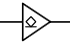
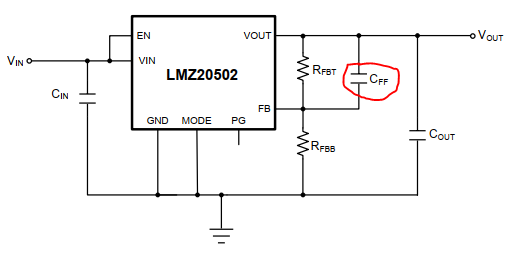
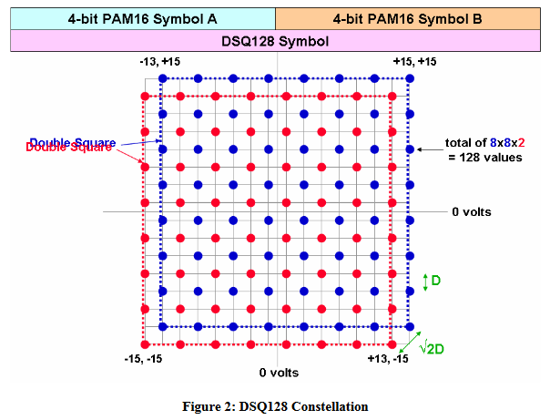
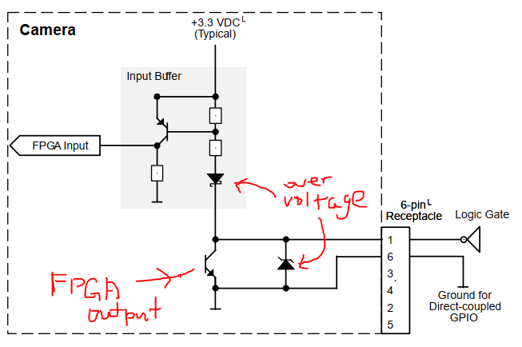
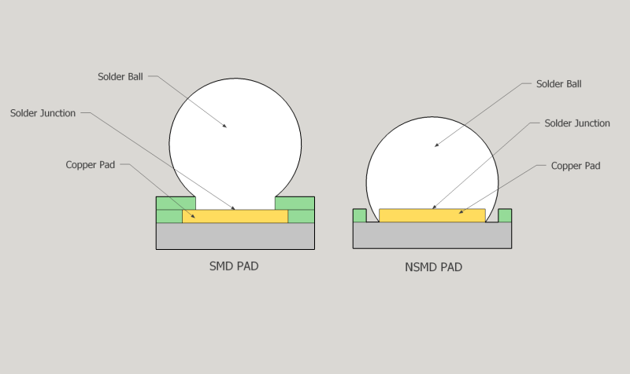
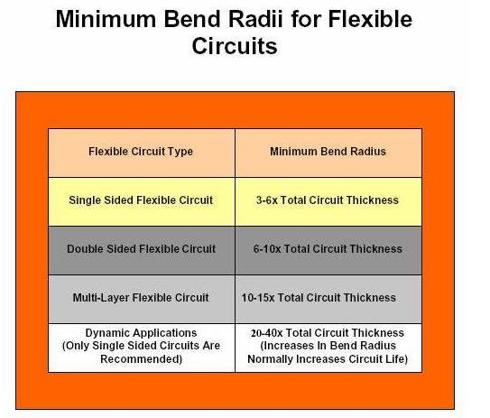
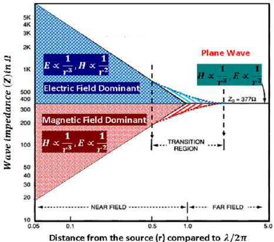
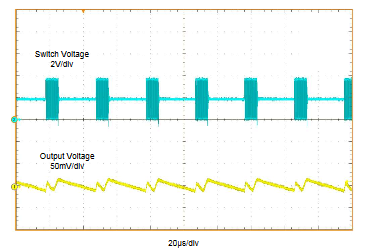
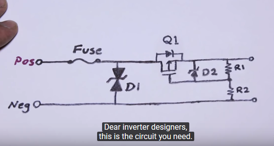
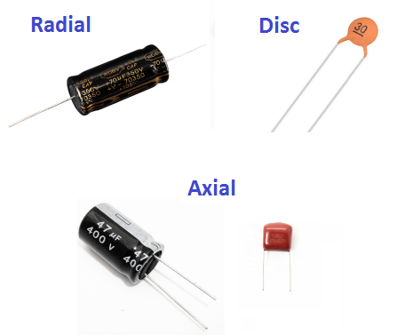

# Hello

* [Bogatin’s Rules of Thumb](https://www.edn.com/bogatins-rules-of-thumb/)

## Analogue circuit

* 4-level LVCMOS input: 0, R, F, 1
  * 4 voltage interval, e.g.
    * 0: `0 - Vcc*0.25 - 0.3`
    * R: `Vcc*0.25 + 0.3 - Vcc*0.5 - 0.3`
    * F: `Vcc*0.5 + 0.3 - Vcc*0.75 - 0.3`
    * 1: `Vcc*0.75 + 0.3 - Vcc`
  * usually config pin, achieve desired voltage by putting different resistors against GND/Vcc

### Open collector

behaves like a switch that is either connected to ground or disconnected

### Zero-ohm link

* typically 10–50 mΩ
* For trace requiring large trace current, better use a 0.001-0.003-ohm resistor, rather than the generic "zero-ohm" resistor in which the actual resistance may be higher, and tolerance is not given

* Usage:
  * Jumper
  * Selective connections
    * R40, R41, R44, R45 in [06-22332B schematic](C:\Users\aeemcng\Documents\Cone\2019-07-03_burnt_5M_cam\06-22332_@_A1_NOTED.pdf)  
      
      * 0 ohm between USB port and CY7C68013A USB Peripheral Controller
      * not a jumper
        * either use 0 ohm resistor / the U6 choke, actually U6 is absent in the real product
    * > Concern of the 0ohm resistance (we may call it the “bridge”) is not current capacity, but how much impedance it will create.  2A passing through 10 milliohm will drop the 0.85V by more than 2%.  AC impedance also needs to be considered (i.e. whether the bridge will become current path bottleneck).  If the load is scattered on power planes, it would be better to provide more bridges to connect two planes because it will result in more effective use of the planes.
  * Current sensing before production
    * [StackExchange](https://electronics.stackexchange.com/questions/42756/what-is-the-usage-of-zero-ohm-miliohm-resistor)
    * provide a current measurement point. During development and testing you can place a low resistance shunt resistor to measure the current, and for production replace it with a zero ohm jumper. Then you don't have to cut traces to insert the shunt resistor in the circuit. Probably less applicable, since you should have measured the current before creating the final PCB, but for very low current circuits the layout and PCB material may matter, and then you do want to measure on the final board.

* Calculation: consider power & voltage loss
  * source of resistance: solder, 0ohm resistor, constrainted PCB traces connection the 0Ω resistor
  * e.g. Resistor: 20mΩ
         Solder: Resitivity × Length ÷ Area  
               = 0.153 μΩ∙m × 0.45mm?(~ height of SMD) ÷ (0.45mm×0.85mm)?(~W × H)
               = 0.00018μΩ = ~0Ω

### Shunt

[StackExchange](https://electronics.stackexchange.com/questions/42756/what-is-the-usage-of-zero-ohm-miliohm-resistor)

* Bypassing the sense resistor with a capacitor - maybe 10 uF or 100 uF depending on circuit
  * further reduce impact on the circuit
* Use an eg 0.1 Ohm shunt,  
  feed the voltage via a series 1k resistor to the meter, and  
  a say 10 uF across the meter terminals.
  * reduce affected by high frequency noise

### Snubber for relay

[Stack Exchange](https://electronics.stackexchange.com/questions/26944/when-why-would-you-use-a-zener-diode-as-a-flywheel-diode-on-the-coil-of-a-relay)

#### RC Snubber

RC circuit -> reduce V surge
please refer to ELEC3143 Power Electronics

#### MOV (Metal Oxide Varistor)

variable resistor that reduce resistance when voltage difference is high
-> I-V characterics look like a diode in both ways
-> absorb energy when the voltage exceeds a certain level

#### Zener Snubber

Flyback diode + Zener in series (of course in anodes opposite direction, so current flow in the same direction)
single flyback diode: RL circuit -> slow
with Zener: drop immediately -> fast

### Power Electronics

* Switchimg-mode power supply
  * hissing or high-pitched whistling
    * loose connection
    * [What could cause a desktop power supply to “hiss”?](https://superuser.com/questions/295075/what-could-cause-a-desktop-power-supply-to-hiss)
      * damaged voltage regulator, caused by voltage spikes/dips/lighting or failed components e.g. leaking cap
      * power not stable
    * capacitor squeal <- gas leakage from E-cap

  * coil whine = low frequency noise
    * [Coil whine and signs of a degrading power supply](https://www.eevblog.com/forum/beginners/coil-whine-and-signs-of-a-degrading-power-supply/)
    * [Charger noise “coil whine”](https://electronics.stackexchange.com/questions/313125/charger-noise-coil-whine)
      * skip pulses at low load -> audiable noise
    * [What Is Coil Whine, and Can I Get Rid of It on My PC?](https://www.howtogeek.com/297166/what-is-coil-whine-and-can-i-get-rid-of-it-on-my-pc/)
      * nothing to be concerned about

* V-A 4 quardants: +/- V/A
  * normal power supply 1st quardant only
  * push-pull: 1 & 3 (+V +A or -V -A)
  * not normal one (op-amp?)
  * output current is -ve
    * so that power dissipation on this device = V * A, if -ve A -> power output

#### Buck converter

* ripple calculation
  * $Duty cycle (D) = V_out / {V_in(max) * efficiency (η)} $
  * $Inductor ripple current ΔI_L = {(V_IN(max) - V_OUT) * D over {f_s * L}}$
  * [BasicCalculation of a BuckConverter's Power Stage](https://www.ti.com/lit/an/slva477b/slva477b.pdf)

* [Comparing Synchronous and Non-Synchronous DC/DC Converters](https://training.ti.com/comparing-synchronous-and-non-synchronous-dcdc-converters)
  * Non-Synchoronous: traditional method, use diode
  * Synchronous: use FET
    * smaller critical path area -> reduce EMI

* multiple buck converters work in parallel to provlde more current
  * Challenge:
    * [5 things you need to know about paralleling DC-DC converters](https://www.electropages.com/blog/2015/09/5-things-know-about-paralleling-dc-dc-converters)
    * [Multiple buck converters from same source?](https://electronics.stackexchange.com/questions/251145/multiple-buck-converters-from-same-source)
    * different in output voltage -> the high one will be most of the current -> over current

  * [TPS54620 Parallel Operation](https://www.ti.com/lit/an/slva389/slva389.pdf)
    * use COMP pin: Peak Current-Mode Control + original Voltage-Mode Control

  * [How to parallel two DC/DC converters with digital controllers](https://www.ti.com/lit/an/slyt748/slyt748.pdf?ts=1602207925763&ref_url=https%253A%252F%252Fwww.google.com%252F)

* integrated inductor
  * TI called "buck module"
  * maxim called "Power Module with Integrated Inductor" (e.g. MAXM17544)

### Control Theory

* compensation capacitor
  * for [frequency compensation](https://en.wikipedia.org/wiki/Frequency_compensation)
  * e.g. LMZ20502 Voltage regulator's feedback (C_FF)
    * 

### Op-amp

* calculate power dissipation:
  * current source: (V+ - V_out) * I_out
  * current sink: (V_out - V-) * I_out
  * think of the BJT's structures and you'll know why

* Input/Output rail-to-rail / over-the-rail
  * Input/Output can close to / over supply voltage
    * Note: @ higher current the op-amp may not be able to output voltage close to rail
    * Note: "capable to do sth" doesn't gurantee working properly, may performance degrade @ close to rail, e.g. worse rejection ratio

* Power sequencing
  * better V+/- before input
  * https://www.analog.com/en/analog-dialogue/articles/improper-power-sequencing-in-op-amps-analyzing-the-risks.html

* Unused pin
  * https://www.analog.com/en/analog-dialogue/raqs/raq-issue-46.html
  * connect as follower (i.e. buffer), but not tied to power supply -> output offset from power supply otherwise -> saturation -> wasted power if the offset voltage has the wrong polarity, so "potential somewhere between the supply rails"
  * Don't floating -> ESD -> latch-up (-> fail to work) or saturation (-> power wasted)

* capacitive load
  * [Ask The Applications Engineer-25: Op Amps Driving Capacitive Loads](https://www.analog.com/en/analog-dialogue/articles/ask-the-applications-engineer-25.html)
  * [Do-it-yourself: Three ways to stabilize op amp capacitive loads](https://e2e.ti.com/blogs_/b/analogwire/archive/2017/08/01/do-it-yourself-three-ways-to-stabilize-op-amp-capacitive-loads)
  * capacitive load -> RC circuit with R_O in op-amp -> oscillator
    * solution:
      * higher noise gain
      * out-of-loop compensation
      * in-loop compensation
      * use op-amp w/ higher "capacitive load drive capability", e.g. op-amp w/ "unlimited" load capacitance

* signal gain VS noise gain
  * https://www.sciencedirect.com/topics/engineering/noise-gain

* Fractional Gain: 0 < Gain < 1
  * https://forum.allaboutcircuits.com/threads/question-about-a-fractional-gain-op-amp.123353/
  * low source impedance: voltage divider -> follower
  * high source impedance: unity gain inverter -> inverting amplifier

* compensation
  * gain compensation
  * lead compensation
  * no compensation -> may unstable
  * usually built-in compensation, but some op-amp doesn't and let the user to have more degree of freedom
  * compensation designed to work at certain signal gain
    * e.g. 54-04228-1S OPA228, check datasheet section "USING THE OPA228 IN LOW GAINS"

  * out-of-loop compensation: add an ext. res in series to op-amp output
    * stable -> output impedance (which introduce a pole)
      * AC: usually datasheet has graph
        * e.g. LT6220 "Output Impedance vs Frequency", output Z capped to 100 Ohm
      * DC: can guess w/ rail-to-rail, but not to accurate bcz working condition ain't usually there
      * if ext. res in series << output Z, ext. res doesn't help much
    * LT6220 has graph "Series Output Resistorvs Capacitive Load", so you don't need to guess from output Z

## Digital circuit

* Passive Delay Line
  * [Passive Delay Line Design Considerations](http://www.rhombus-ind.com/dlcat/app1_pas.pdf)
  * A Passive Delay Line is a special purpose Low Pass Filter designed to delay (phase shift) the input signal by a specified increment of time, and is composed of series inductors and shunt capacitors with values dictated by the line impedance.

* Schmitt trigger
  * comparator with hysteresis: originally LOW, need higher voltage to switch to HIGH, vice versa
  * achieved by positive feedback to noninverting input of a comparator
  * e.g. 74HC9115

* Ground bounce
  * [Allaboutcircuits](https://www.allaboutcircuits.com/technical-articles/how-to-reduce-ground-bounce-mitigating-noise-pcb-design-best-practices/)
  * CMOS in IC: inductance in trace between output and VDD/GND -> when changing state, inductance causes -ve voltage -> Gate voltage not low enough, MOS keep open and close -> oscillate
    * solution: decoupling cap close to ICs power rail, current limit resistor, reduce inductance i.e. shorter return path

* differential signal
  * "_t" true signal; "_c" complementary signal

### Signal

* UI: Unit interval = 1 / baud
* Baud = symbol rate, Baud rate = ATM machine (grammatically)
* Slack
  * [(原創) timing中的slack是什麼意思? (SOC) (Quartus II) - 真 OO无双](https://www.cnblogs.com/oomusou/archive/2010/08/04/timing_slack.html)
  * Required arrival time (RAT): affected by setup time / hold time of next clock edge and clock skew
  * Actual arrival time: based on hold time from this clock edge, propagation delay though logic and clock skew

  * Setup Slack =  RAT - Actual arrival time
    * worst on slowest path
      * [What is the best way to improve negative slack? - Xilinx Forum](https://forums.xilinx.com/t5/Timing-Analysis/What-is-the-best-way-to-improve-negative-slack/td-p/995872)
      * Possible reasons: too much processing, clock crossings, I/O, high fanout
        * high fanout -> either:
          * high capacitance -> long rise/fall time
          * help you add buffer in synthesis -> added delay
      * To improve: use constants, LUT, parallel processing, use other synthesis strategies to prevent high fanout

  * Hold Slack = Actual arrival time of next data - RAT
    * worst on fastest path (e.g. flip-flop to flip-flop), but usually solved by the router in FPGA implementation

  * Setup slack is a function of frequency but hold slack is not
    * [Negative Hold Slack for AXI Interconnnect - Xilinx Forum](https://forums.xilinx.com/t5/Timing-Analysis/Negative-Hold-Slack-for-AXI-Interconnnect/m-p/1073222#M18781)

  * -ve (setup) slack = SHIT!
  * -ve hold slack
    * case study - GMAX2505 POC sensor board:
      * root cause:
        * clock period 2.083 ns (480 MHz)
        * data path delay 2.000 ns
        * clock path delay 5.297ns bcz clock domain crossing for 2 times (~1.7 ns each) -> much slower than data path
      * possible problems:
        * metability
          * even though the typical timing may still be okay, 10% variation may lead to problem (Can you imagine 10% of 5ns delay, comparing to 10% of 1ns delay?)
        * data clocked @ different clock cycle
          * a problem if there's timing relationship between data paths
      * possible solutions:
        * use global-clock-capable pin for the clock signal
        * add datapath delay

* Repeater = Retimer or Redriver
  * [PCI Express Retimers vs. Redrivers: An Eye-Popping Difference](https://www.asteralabs.com/post/pci-express-retimers-vs-redrivers-an-eye-popping-difference)
  * Retimer: understand protocol, recover and retransmit data, may contain MCU
  * Redriver: analouge device, amplify high frequency signal, CTLE -> Gain -> Driver

#### Signal format

* [Van Eck phreaking](https://en.wikipedia.org/wiki/Van_Eck_phreaking)
* [Data strobe encoding](https://en.wikipedia.org/wiki/Data_strobe_encoding)
  * XOR always equal to clock signal

* line encoding
  * NRZ / NRZI (Non-Return-to-Zero Inverted)
  * Manchester code -> embedded clock
  * 8b/10b
  * PAM4 (4 level pulse amplitude modulation)
    * [PAM4 Signaling Fundamentals - Intel](https://www.intel.com/content/dam/www/programmable/us/en/pdfs/literature/an/an835.pdf)
    * [Is PAM4 really necessary?](https://www.edn.com/is-pam4-really-necessary/)

* RS-485
  * https://store.chipkin.com/articles/rs485-what-are-the-allowed-cable-lengths-and-baud-rates-for-rs485-or-bacnet-mstp
  * [HOW FAR AND HOW FAST CAN YOU GO WITHRS-485?](https://pdfserv.maximintegrated.com/en/an/AN3884.pdf)
    * RS-422 vs RS-485

* LVDS
  * https://application-notes.digchip.com/009/9-12468.pdf
    * LVDS vs RS-422 vs RS-485

* sub-LVDS
  * [Compact Camera Port 2 SubLVDS with 7 Series FPGAs High-Range I/O](https://www.xilinx.com/support/documentation/application_notes/xapp582-ccp2-sublvds-hr-io.pdf)
    * There is no strict eye mask for SubLVDS

* SLVS
  * [Implementing an SLVS transceiver](https://www.edn.com/implementing-an-slvs-transceiver/)

##### I2C

* more peripheral -> more capacitance -> longer rise time -> slower bus speed

###### Inertial delay

[Xilinx forum](https://forums.xilinx.com/t5/Networking-and-Connectivity/Set-INERTIAL-DELAY-in-IIC-module/td-p/495248)

* parameters in Xilinx AXI IIC IP
  * e.g. AXI clock = 100MHz, C_SCL_INERTIAL_DELAY = 5, delay = 10ns * 5 = 50ns
* pulse rejection & delay inside
* SCL delay longer than SDA -> undesirable
* SDA delay longer than SCL -> increase hold time, may eliminate errorneous starts/stops

##### USB

[USB in a NutShell](https://beyondlogic.org/usbnutshell/usb1.shtml)

* Endpoint: 1 IN, 1 OUT
  * EP0 for control transfer
  * at most 16

* in 1 transaction: 1 token packet, 1 or more data packet, 1 handshake packet

* Packet
  * Include diff. fields
    * Sync, PID, ADDR, ENDP, CRC, EOP
    * No any types contains all fields
  * Types: Token, Data, Handshake Packets
    * Token: In, Out, Setup
    * Data: Data0, Data1
    * HandShake: ACK, NAK, STALL

* Transfer
  * Control Transfer
    * Setup, Data, Status Stages
    * reserved 10% (20% for USB3.0) bandwidth for control transfer
      * bandwidth will release if there's no control transfer waiting
  * Interrupt Transfer
  * Bulk Transfer
  * Isochronous Transfer

###### Electrical

| Pin Number | Cable Colour | Function        |
| ---------- | ------------ | --------------- |
| 1          | Red          | V_BUS (5 volts) |
| 2          | White        | D-              |
| 3          | Green        | D+              |
| 4          | Black        | Ground          |

* D+ and D-
  * both differential and single ended
    * differential:
      * 'J' = diff. '0' = D- - D+ > 200mV
      * 'K' = diff. '1' = D+ - D- > 200mV
      * On low and full speed devices, a differential ‘1’ is transmitted by pulling D+ over 2.8V with a 15K ohm resistor pulled to ground and D- under 0.3V with a 1.5K ohm resistor pulled to 3.6V. A differential ‘0’ on the other hand is a D- greater than 2.8V and a D+ less than 0.3V with the same appropriate pull down/up resistors. 
    * single ended:
      * SE0 D+ & D- < 0.3V (low) for > 10ms

* characteristic impedance: 90 ohms +/- 15%

* High Speed (480Mbits/s) mode uses a 17.78mA constant current for signalling to reduce noise. 

* Speed Identification: pulling D+/D-
  * based on speed
    * 1.5k ohm pull up D+: full speed
    * 1.5k ohm pull up D-: low speed
    * High speed devices will start by connecting as a full speed device
  * identify existance of USB device too
  * some ICs uses built-in resistor in silicon -> can turn on/off
    * off before ready for initialising the USB function

* Power
  * Low-power bus powered functions
    * work under 4.40V - 5.25V
    * 1 unit load = 100mA
  * High-power bus powered functions
    * detected and enumerated under 4.40V - 5.25V
    * work under 4.75V - 5.25V
    * 5 unit load = 500mA
  * Self-powered functions
    * 1 unit load from bus = 100mA
      * identification
  * Never drive V_BUS on its upstream facing port
  * Suspend Current 500uA per unit load
    * Sth drawing currents:
      * pull up resistors
      * linear regulator's quiescent current
      * MCU's clock
    * Suspend Mode
      * no activity for 3 ms
        * has to drawn less than suspend current in further 7 ms
      * send frame packet to keep alive
        * high speed: micro-frames every 125.0 µs ±62.5 ns
        * full speed bus: frame sent down each 1.000 ms ±500 ns
        * low speed bus: keep alive which is a EOP (End of Packet) every 1ms only in the absence of any low speed data
    * Signalling rate
      * High speed: 480.00Mb/s ± 500ppm
      * Full speed: 12.000Mb/s ±0.25% or 2,500ppm
      * Low speed: 1.50Mb/s with ±1.5% or 15,000ppm
        * therefore resonator is acceptable for low speed only

  * DCP (Dedicated charging port) signature
    * D+ & D- shorted with <200Ω
    * should provide up to 5A

* USB3.0 link training
  * http://xillybus.com/tutorials/usb3.0-training-by-example

* USB3.0 RX & TX
  * coupling cap
    * [AC-coupling capacitors for high-speed differential interfaces](https://electronics.stackexchange.com/questions/173691/ac-coupling-capacitors-for-high-speed-differential-interfaces)
    * [TUSB1002: AC Coupling Capacitors for USB 3.1 Gen 2](https://e2e.ti.com/support/interface/f/138/t/656208)

* connectors
  * some with a "sensor contact" pin -> detect connection
  * cap near VBUS
    * required by USB Specification
    * host: min 120 uF
    * device: 1 - 10 uF
    * OTG: 1 - 6.5 uF

* [USB Shield. To ground or not to ground? - StackExchange](https://electronics.stackexchange.com/questions/389972/usb-shield-to-ground-or-not-to-ground)

###### Class

[USB-IF](https://www.usb.org/defined-class-codes)

* Application Specific (FEh)
* Vendor Specific (FFh)

###### Enumeration

* SuperSpeed enumeration does not require D+ and D-
  * [USB 3.x SS enumeration - StackExchange](https://electronics.stackexchange.com/questions/297031/usb-3-x-ss-enumeration)

###### OTG

* [USB On-The-Go - Wikipedia](https://en.wikipedia.org/wiki/USB_On-The-Go#Plug)
* A: ID pin connected to ground
  * different resistance to ground -> different ID
* B: ID pin floating

##### PCI Express = PCIe

* _Referenece: [Wikipedia](https://en.wikipedia.org/wiki/PCI_Express#Pinout)_

| Lane         | Total Pin number |
| ------------ | ---------------- |
| before notch | 11               |
| PCIe ×1      | 18               |
| PCIe ×4      | 32               |
| PCIe ×8      | 49               |
| PCIe ×16     | 82               |

##### AXI

###### Handshake

* A3.2.2 Channel signaling requirements - Channel handshake signals
  * for Write / Address, not recommend a default READY, as transfer takes >= 2 cycles (1 for VALID, 1 for READY)

* A3.3.1 Dependencies between channel handshake signals
  * assertion of VALID can never be dependent on READY
    * but de-assertion of VALID should depend on READY (cannot de-assert until READY accepts the transaction)
  * READY can:
    * wait for VALID
    * not detecting VALID at all

##### JTAG

* [JTAG pull-up/down resistors : mandatory or optional?](https://e2e.ti.com/support/microcontrollers/other/f/908/t/348680?JTAG-pull-up-down-resistors-mandatory-or-optional-CORTEX-M4-0-JTAG-Communication-Error-Error-1170-0x0-)
* pull-up / pull-down is necessary for TCK to prevent fake TCK pulse at power up
* ARM: TMS, TDI, TDO must have pull-ups
  * may enter boundary scan mode if not doing so

##### Ethernet

* 10GbE
  * 10BGASE-T, use 4 × twisted pair copper wires
    * [10G Ethernet IEEE 802.3an - Allan Nielsen - Tyco Electronics](http://www.ikn.no/download/Whitepaper-10G-Ethernet-10-08.pdf)
    * PAM16 @ 800Mbaud
      * 2 symbols form 256 combination, but only 128 are used (DSQ128) => 7 bit / 2 symbols
        * 
        * Separation  between  adjacent  DSQ128  code  values  is  increased  by  √2  compared  with  a  conventional  16x16  orthogonal  array;  this  provides  3dB  improvement  in  signal-to-noise  ratio  and  leads  to  a  significant reduction in bit-error-rate (BER)
      * 1024 symbols (i.e. 512 DSQ 128 labels) forms a DSQ128 code block with LDPC (1723, 2048), so there are 512 × 7 bits, but 325 check bits are used for each code block
      * (7 bit × 512 - 325) ÷ 1024 = 3.18 bit / symbol
      * 64b/65b coding + frame sync + CRC -> 3.15 bit / symbol
      * 800 Mbaud × 3.15 × 4 lines = 10 Gbps
    * [0GBASE--T: T: 10Gbit/s Ethernet over copper10Gbit/s Ethernet over copper - Broadcom](https://www.southampton.ac.uk/~sqc/EL336/10GBASE-T.pdf)

##### Quad-SPI (QSPI)

* [AN4760 - Quad-SPI interface on STM32 microcontrollers andmicroprocessors](https://www.st.com/content/ccc/resource/technical/document/application_note/group0/b0/7e/46/a8/5e/c1/48/01/DM00227538/files/DM00227538.pdf/jcr:content/translations/en.DM00227538.pdf)

* 6 pins, half-duplex
  * SS, CLK, 4 × I/O
* need to handle address

#### Signal integrity

* slew rate
  * ΔV/s or ΔA/s
  * higher slew rate -> higher frequencies of intrest, higher EMI

* phase noise in frequency domain = jitter in time domain
  * phase noise mask -> important to reference clock
    * Unit: dBc/Hz (power ratio of a signal to a carrier signal, per Hz, i.e. integrated)
  * Ref: [Question about K7 GTX reference clock rise time](https://forums.xilinx.com/t5/Other-FPGA-Architecture/Question-about-K7-GTX-reference-clock-rise-time/td-p/732877)
    * Why rise & fall time is unimportant to ref. clk.

##### high speed connection

* not much design difference
* ESD protector

##### cable

###### USB shielding & termination

* attenuation
* insertion loss
* return loss
  * Voltage Standing Wave Ratio (VSWR) is the same thing, just a different calculation
    * Reflection coefficient Γ = V_r (reflected) / V_f (forward) = (Z_L - Z_O) / (Z_L + Z_O)
    * VSWR = (1 + |Γ|) / (1 - |Γ|)
    * return loss = -10 log Γ^2 (because return loss is related to power) = -20 log ((VSWR - 1)/(VSWR + 1))
* skew rate
* EFT test
* EMC resortion lost
* Eye pattern
  * [Understanding Eye Pattern Measurements](https://rintintin.colorado.edu/~gifford/5830-AWL/Anritsu%20Eye%20Diagram.pdf)

  * Eye Crossing Percentage = [(crossing level – zero level) / (one level – zero level)]
    * Eye crossing is the crossing points (X-shape) on the left/right of the eye pattern
    * Percentage is a measure in vertical axis
  * Eye Height = (One level - 3σ) - (Zero level + 3σ)
  * Signal-to-Noise Ratio = (One level - Zero level) / (1σ [One level] + 1σ [Zero level])

  * Eye Width = (right crossing - 3σ) – (left crossing + 3σ)
  * Jitter: variances at the eye crossing point
    * = phase noise in frequency-domain

* instrument: network analyzer
  * source of error
    * fixture loss calibration
    * setup parameter
      * rise time
      * IF resolution
      * sampling frequency

##### Transmission line model

Ref: *ELEC3342 Ch. 8*

transmission line effect: ringing in transmission

apply when:

* rise time ~= path delay
  * depends on:
    * length
    * speed of light in the medium

* trace length
  * [Why do characteristic impedances matter only when traces are longer than half a wavelength? - Stackexchange](https://electronics.stackexchange.com/questions/178112/why-do-characteristic-impedances-matter-only-when-traces-are-longer-than-half-a)
  * [How to Calculate Trace Length from Time Delay Value for High-speed Signals - ZUKEN Blog](https://blog.zuken.com/how-to-calculate-trace-length-from-time-delay-value-for-high-speed-signals/)
    *             v_Er = f λ_Er  
          c / sqrt(Er) = f λ_Er  
      c / sqrt(Er) / f = λ_Er
    * v_Er: signal speed on a PCB transmission line
    * Er: dielectric constant of the PCB material, 4 for FR4
      * if microstrips is used instead of striplines, Er_effective ~ (0.64 Er = 0.36)
    * trace length need to be 1/10 of λ_Er

###### Characteristic Impedance

* ratio between voltage and current waves that travel down the channel
* uniform, lossless line: Z_0 = sqrt(L/C)
* typical: 50-75 ohm
  * [Why Fifty Ohms?](https://www.microwaves101.com/encyclopedias/why-fifty-ohms)
    * 50 ohms
      * insertion loss for air dielectric coax has a minimum around 77 ohms
      * 30 ohms has best power handling
      * compromise between 30 & 77 ohms
    * 75 ohms for video
      * does not need to carry high power
      * minimum loss occurs @ 52 ohms for solid PTFE
      * lower Z => larger diameter
      * compromise between low loss and cable flexibility

Ref: *[What is Characteristic Impedance? - Eric Bogatin](..\Hello_references\BTS002_Characteristic_Impedance_NOTED.pdf)*

* Z_0 = 1/(C_L v), C_L = C of the line, v = speed of the signal

* Impedance mismatch when connecting multiple DRAM -> T in the lines
  * [Selecting different impedances then 50 ohm in DDR3 - StackExchange](https://electronics.stackexchange.com/questions/108345/selecting-different-impedances-then-50-ohm-in-ddr3)s

###### Reflections

* occurs when unmatched line with source/load
* Γ = (Z_L - Z_0)/(Z_L + Z_0)
* V_reflected = Γ V_incident

###### Termination

* Source termination: invalid levels momentarily
  * e.g. P2P connection
  * [Driving Multiple Loads with Source Termination](https://flylib.com/books/en/1.389.1/driving_multiple_loads_with_source_termination.html)
* Load termination: power dissipation exists
  * e.g. multi-drop bus
* Both end
  * e.g. bus with multiple receivers and drivers <- prevent reflections from either end

##### Intersymbol Interference

* bit affected by bit before
* sources:
  * Next bit before reflections damp out
    * unterminated transmission line: mim. bit time = several round trips
  * dispersion <- nonzero line resistance
  * cross talk
    * capacitance to its neighbour
    * noise on non-switching wires
      * if victim is floating: 
      * if victim is driven: 
    * increased delay on switching wires
    * https://electronics.stackexchange.com/questions/439213/ribbon-cable-cross-talk-is-there-a-fix-after-the-fact
      * reduce cross talk:
        * ground wire separating signals
        * reduce slew rate <- increase value of source termination resistors
        * etc.
  * ground bounce <- nonzero return path impedance

#### High-speed I/O

Ref: *ELEC3342 Ch. 8*

* transmit data > flight time
* high-impedance driver + load termination?
* low-impedance driver + source termination?

##### Repeater

* Reason: R, C proporational to l -> RC delay proporation to l^2
  * break long wires into segments -> l/N
* buffer or inverter

#### Signal Processing

* Dither
  * [Dither - Wikipedia](https://en.wikipedia.org/wiki/Dither#Digital_photography_and_image_processing)
  * For signal, apply random noise to reduce quantization distortion
    * e.g. for real signal 0.8 1.6 2.4 3.2 4.0 4.8 5.6 6.4 results 0 1 2 3 4 4 5 6 after sampling, hence there are some regular and repeated error (e.g. error of 0.2, 0.4)  
      In frequency domain, the error can be seen as peaks (harmonics), and they are audible to human ears  
      Applying random noise reduces the amplitude of certain harmonics
  * For image, use fewer pallete size (e.g. B/W, 256 colour) to represent more colour, e.g. changing grey colours into repeatative black and white dots

#### Clock

* crystals instead of oscillators:
  * crystal cut, oscillation mode, calibration mode, PPM budgets, shunt capacitance, load capacitance, drive level, equivalent series resistance etc.
  * e.g. USB3320 P.16 TABLE 4-11: USB3320 QUARTZ CRYSTAL SPECIFICATIONS 

* [Could I use a single oscillator to clock multiple devices?](https://www.eevblog.com/forum/microcontrollers/could-i-use-a-single-oscillator-to-clock-multiple-devices/)
  * concerns:
    * load capacitance
    * reflection -> minimize stubs
    * sync or not?
    * more limitations if crystals instead of oscillators

  * solutions:
    * just do it!
    * clock buffers / use FPGA as clock buffers (especially when you have to sync 2 clocks)

#### SerDes

* Phase Detector
  * https://ocw.mit.edu/courses/electrical-engineering-and-computer-science/6-976-high-speed-communication-circuits-and-systems-spring-2003/lecture-notes/lec21.pdf
  * detect phase error between clock and data
  * e.g. Hogge Detector (output signal proporational to phase error), Alexander Bang-Bang Detector (output signal indicates sign of phase error)

### I/O

#### GPIO

* 
  * upper part: input - Diode-transistor logic
  * transistor in lower part: output

## High-level digital circuit design (e.g. FPGA)

### FPGA

* CLB (configurable logic block)

* Simulation
  * input **cannot** change at the same time as rising edge of clock
    * if clock is in another process, the order of the execution between these processes is unknown -> unexpected result

* Synthesis
  * logic level reduction

* Async. design is inevitable, need to handle clock domain crossing
  * e.g. spread spectrum
    * but usually absorb in setup / hold time

* <https://www.nandland.com/articles/fpga-101-fpgas-for-beginners.html>
  * [How To Get A Job In FPGA - The Resume](https://www.nandland.com/articles/resume-writing-for-fpga.html)

### Low-pass filter

* design consideration: the signal that you want to filter
  * noise has specific waveform (e.g. EFT, ESD human-body model)
  * based on sampling rate and latency requirement, select target clock

* high speed -> analogue; low speed -> digital
* Debouncer
  * Take multiple samples, change state only when all samples are the same
    * Actually it's just a low-pass filter with extreme threshold!

* Implementation
  * Method 1: shift register, take all input
  * Method 2: counter and FIFO, +1 if HIGH, -1 if LOW for FIFO in,  -1 if HIGH, +1 if LOW for FIFO out
    * may be better because more flexible, and the actual implementation is similar to method 1
  * Method 3: counter, +1 if HIGH, -1 if LOW, but there's upper limit and lower limit
  * BTW, Low-pass filter is just a subset of FIR/IIR filters!

### DMA

* DMA is an **ability**
* **bus master** can be a **DMA Controller**, a **CPU** or a **FPGA**'s functional block

### Testing

* AOI
  * check SMD
  * A5M standard: usually do if MP

* In-circuit testing (ICT)
  * Method 1: jig, $5000 ~ $15000
    * the more the cables, the more expensive the jig is
    * can check continuity and voltage (by driving some testing pins)
    * Boundary scan will do at the same time, used to check BGA IC
  * Method 2: flying probes
    * can check continuity only
  * A5M standard
    * complex enough & > 30/month & there's testing points on PCB
      * exception: PCB w/ many conn, no need to ICT
      * exception: 64-22939, board size not enough (unless to ICT when the panelized board is not separated)
      * e.g. must do with BGA

* Functional Test (FCT)
  * all external ports should be tested -> use a test jig
  * internal: on-board self test if possible
    * FPGA: exercise every blocks if possible (fpga can damage individually)
      * design a single test that pass all blocks, e.g. 8 MIPI IP
    * Processor: if one code work, usually everything will work <- SW stuffs

## Package

* Dimension
  * BSC (Basic Space between Centres)
    * [Xilinx Forum](https://www.xilinx.com/support/answers/8393.html)
    * is used to describe the **theoretically** exact size, shape, or location of a feature or datum target; this is shown on drawings enclosed in a rectangle. It is the basis for determining which permissible variations are established by tolerances on other dimensions.
  * REF (Reference)
    * = appropximately

* system in a package (SiP)
  * >= 1 chips enclosed in one or more chip carrier packages that may be stacked using package on package
    * Dies containing integrated circuits may be stacked vertically on a substrate

## Measurement

* Response Time
  * [Response Time Measurement](https://www.tftcentral.co.uk/articles/response_time.htm)

### Instrument

* Thermocoupler
  * [感溫棒(熱電偶)的接線種類差異與選擇、Ktype、Ntype、Stype、Jtype-SJ儀錶](https://www.sj-gauge.com/_tw/faq/detail.php?cid=15&faqid=167)

* example of vendors
  * Keysight
  * Fairview Microwave
  * Southwest Microwave
  * Amphenol
  * Hubersuhner
  * Rosenberger

## PCB

* Active Low
  * Recommanded
    `my_signal#`, PCI standard
  * Not recommanded
  * `/my_signal`
  * `my_signal` with a bar on top
    * the bar may mixed with signal line
  * `my_signal_n`
    * may mixed with differential signal (`_p`, `_n`)
  * `my_signalb`

* Fiducial Mark
  * [What is a Fiducial Mark - PCB 3D](http://www.pcb-3d.com/tutorials/what-is-a-fiducial-mark/)
  * referent points on the PCB to position the Surface Mount Components (Packages) on the PCB during assembly

* Via
  * through hole VS blind (in one of outermost layers only) VS buried (not shown in outermost layers)
    * cost with blind/buried vias is significantly higher
  * via-on-pad
    * [導通孔在墊(Vias-in-pad)的缺點及處理原則](https://www.researchmfg.com/2010/11/vias-in-pad/)
    * Copper-Filled Vias
      * [What Are Copper-Filled Vias?](https://www.mclpcb.com/copper-filled-vias/)
      * fills the through holes with epoxy resin and copper
      * increase thermal and electrical conductivity

* Thinkness = Cu weight
  * 1oz of copper = 1oz of copper is pressed flat and spread evenly over a one-square-foot area
    * = 1.37 mil
    * = 0.03479 mm
  * minimum space between copper features
    * [Copper Thickness FAQ - PCB Universe](https://www.pcbuniverse.com/pcbu-tech-tips.php?a=4)
    * 1oz: 3.5 mil
    * 2oz: 8 mil
    * 3oz: 10 mil
  * DNP in schematics
    * Do Not Place
    * a.k.a. NS / DNS (Do Not Stuff), DY (part not installed), DNI, SOT, DNF (Do Not Fit), POP (Populate OPtion), SOT
      * https://www.eevblog.com/forum/beginners/ns-resistor-do-not-stuff-!!/

* multi-layer board
  * [Stack Exchange](https://electronics.stackexchange.com/questions/356063/what-exactly-is-prepreg-and-core-in-a-pcb)
  * copper - prepreg - copper - core - copper - prepreg - copper
    * usually FR4

  * 6-layer
    * more place to route: Top - GND - Signal - Signal - PWR - Bottom
    * better EMC: Top - GND - Signal - PWR - GND - Bottom
      * inner signal is immediately adjacent to GND -> shorter return path + planner capacitance
    * https://resources.pcb.cadence.com/blog/2019-pcb-design-for-the-6-layer-board-stackup

* BGA
  * SMD VS NSMD
    * 
    * [MACROFAB](https://macrofab.com/blog/bga-pad-creation-smd-nsmd/)
    * depends on manufacturers' recommended footprints
    * NSMD pad style is recommended wherever possible due to its improved solderability and pad accuracy
* differential pair length matching

* Embedded Resistor / Capacitor
  * additional inner layers
  * can't have res / cap in different orders of magnitude
  * e.g. https://www.venture-mfg.com/embedded-resistor/

* Edge plating / metallizaing
  * pros
    * improve EMC by encapsulate sensitive traces
  * https://www.linkedin.com/pulse/what-advantages-edge-plating-pcb-sean-yang

  * plated half-holes (castellated holes)
    * to connect to other boards
    * https://www.pcbway.com/pcb_prototype/What_are_Plated_Half_Holes_Castellated_Holes_.html
    * more-than-a-half holes: https://prototypepcb.com/castellated-holes/
      * 

* Reference Designator
  * [The table below lists designators commonly used, and does not necessarily comply with standards.](https://en.wikipedia.org/wiki/Reference_designator#Designators)
  >> A - Separable Assembly
  >> AR - Amplifier
  >> AT - Attenuator; Isolator
  >> B - Blower, Motor
  >> BT - Battery, Battery Cell - , Solar Cell
  >> C - Cap: Fixed, Variable, Multi-element
  >> CB - Circuit Breaker, Network protector
  >> CP - Connector Adapter, Coupling
  >> D or VR - Breakdown Diode, Zener Diode
  >> D - Diode, Transzorb
  >> DC - Directional Coupler
  >> DL - Delay Line
  >> DS - Display, Lamp, LED - , Visual Indicator
  >> E - ANT, Terminal, Ferrite Bead Ring, Misc. Electrical Part
  >> F - Fuse
  >> FD* - Fiducial
  >> FL - Filter
  >> G - Generator, Oscillator
  >> H - Hardware
  >> HY - Circulator
  >> J - Connector, Jack, Most fixed of pair
  >> K - Contactor, Relay
  >> L - Coil, Inductor
  >> LS - Loudspeaker, Buzzer
  >> M - Meter
  >> MG - Motor-generator
  >> MH* - Mounting Hole
  >> MK - Microphone
  >> MP - Mechanical Part
  >> P - Conn., Plug, Most movable of pair
  >> PS - Power Supply
  >> Q - Transistor, SCR
  >> R - Res: Fixed, Variable, Multi-element
  >> RT - Thermistor, Thermal Resistor
  >> RV - Symmetrical Varistor
  >> S - Switch
  >> T - Transformer
  >> TB - Terminal Board, Terminal Strip
  >> TC - Thermocouple
  >> TP** - Test Point, In-circuit Test Points
  >> U - Inseparable Assembly, IC Pkg.
  >> VR - Voltage Regulator
  >> W - Wire, Cable, Cable Assembly
  >> X - Holder: Fuse, Lamp, Battery Socket
  >> Y - Crystal, Crystal Oscillator
  >> Z - Balun, General Network, Phase Shifter

* Jumpers
  * zero-ohm links
  * jumper pads
    * [Why would I use triangular solder jumper pads?](https://electronics.stackexchange.com/questions/439270/why-would-i-use-triangular-solder-jumper-pads)
      * triangular -> longer length of the gap -> easier to create a solder blob

### PCB fabrication

* Design guidelines
  * https://www.hemeixinpcb.com/pcb-technology/

* FPC
  * 

### PCB assembly

* Wave soldering
  * [SMD零件可以走波焊(wave soldering)製程？ - 電子製造，工作狂人](https://www.researchmfg.com/2013/05/smd-go-wave-solder/)
    * 紅膠 below SMD device
      * not feasible if smaller than 0402, as it may short-circuit / non-wet solder

* Reflow
  * [如何讓通孔元件/傳統插件走回焊爐製程(Paste-in-Hole, PIH) - 電子製造，工作狂人](https://www.researchmfg.com/2010/11/dip-paste-in-hole/)
    * Paste-In-Hole, solder thou-hole components with reflow soldering

  * solder paste thickness ~ 0.15mm (ref: Deng Bin)
    * solder thickness after reflow should be smaller than that, unless cold solder (e.g. not hot enough, oxidized) -> surface tension create a sphere

* solder
  * mixing leaded and leadfree => not eutectic, i.e. not melt or solidifie at a single temperature
    * only alloy with particular composition is eutectic, e.g. 63 Pb/37 Sn
    * [mixing lead solder with lead free solder -  EEVblog Electronics Community Forum](https://www.eevblog.com/forum/beginners/mixing-lead-solder-with-lead-free-solder/)
  * [How-To: Go Green With Lead Free Solder](https://hackaday.com/2008/05/22/how-to-go-green-with-lead-free-solder/)

* 工藝邊 Breakaway tabs (?)
  * will be removed after assembly

* why can't we put something on non-standard decal
  * decal not symmetry: pull component to one side
  * solder pads too large: solder pull towards centre by surface tension during reflow -> cold solder

### Ground

* Ground region - separated in ground plane
  * usually continuous ground is good enough
    * Don't separate ground (e.g. DGND, AGND), unless you know clearly how to do, why to do and what to do
      * e.g. analogue and digital components
  * Signal Interconnect - Principle
    * Signal is always a loop, larger loop -> *usually* more interference because like an antenna
      * e.g. ground layer shorten the loop
      * Solution:
        * singal on upper layer, bridge between ground plane in ground layer right underneath it

* [What are the advantages of having two ground pours?](https://electronics.stackexchange.com/questions/41919/what-are-the-advantages-of-having-two-ground-pours)
  * > if I understand correctly, especially from the last paragraph, I shouldn't use a pour on the top layer at all, correct?
  * > Yes for most cases. Exceptions are special high speed signals, signals that must be impedance controlled, signals that must be delay-matched, etc.
  * > The high frequency power loop current of a part should go out the power pin, thru the bypass cap, and back in to the ground pin without ever running accross the ground plane. This means you don't use a separate via for the ground side of the bypass cap. Connect it directly to the ground pin on the top side, then connect that net to the ground plane with a via at a single point. This technique will help a lot with RF emissions and cleanliness in general.

* [Is a copper pour redundant on the top layer of a multilayer (>= 4) board with a ground plane?](https://electronics.stackexchange.com/questions/369576/is-a-copper-pour-redundant-on-the-top-layer-of-a-multilayer-4-board-with-a)
  * Tag: crosstalk
  * > Adding copper between signals to reduce crosstalk only works if the copper is effectively grounded at the frequency of interest. For audio, it can potentially help. But for high speed clocks, it will likely make the crosstalk worse since the fill copper has high impedance to GND (relatively speaking).
  * > To reduce crosstalk, focus on leaving lots of space around the potential aggressor signals such as clocks. The worst thing you can do is route them along side each other or directly over/under without a ground plane between.

* [multi-layer board copper pour](https://electronics.stackexchange.com/questions/26283/multi-layer-board-copper-pour)
  * > Using a copper pour on layers which contain signals is **dangerous** because it's surprisingly easy to create **current loops**
  * > For a multi-layer board, adding a **broken** copper plane **isn't a problem** because you can connect the broken plane to the intact internal plane without too much trouble.
  * > If you want to add it for appearance, to have the extra ground connections for probing or rework, to improve your EMC characteristics, or to add additional heat sinking, you should **connect it to ground**. 
  * > **do not pass any current** in the top or bottom pour plane. Make it a NO-NET. Then add a via to connect it to it's **internal GND plane** inside board layers. 

#### CHGND = Chassis ground

* [Stack Exchange](https://electronics.stackexchange.com/questions/149643/physically-how-does-connecting-a-pcb-to-chassis-ground-reduce-noise)
* [Stack Exchange](https://electronics.stackexchange.com/questions/357474/circuit-ground-vs-chassis-ground)
* [EEVblog Electronics Community Forum](https://www.eevblog.com/forum/projects/usb-shield-ground-connection/)
* Capacitor to Digital Ground
  * low impedance path for high freq.
    * USB connector -> chassis ground -> digital ground
  * but why cap for metal shell too?

#### Use thick ground plate to short CHGND together

* In [06-22332B schematic](C:\Users\aeemcng\Documents\Cone\2019-07-03_burnt_5M_cam\06-22332_@_A1_NOTED.pdf)
* between the case of USB port and CHGND

#### e.g.

* ESD -> connector pins to MGND
* 

### Thermal

* graphite sheet roll into a block
  * volume resitivity high but surface resitivity low
  * less affected by thickness, can up to 10~20mm
  * should be non-conductive

* high wattage IC e.g. FPGA, thermal can actually be put under PCB, as copper couduct better than the plastic package
  * bottom cannot have huge components
  * even better: Specific a GND pad for thermal pad!

* layout design
  * e.g. thermal conductivity of ground plane
  * online calculator!

* coefficient of thermal expansion (CTE)

* IC parameters
  * [Semiconductorand IC Package Thermal Metrics - TI](\\AHKPC0393\Cone\Hello_references\spra953c_Semiconductorand IC Package Thermal Metrics_NOTED.pdf)

  * Operating junction temperature, T_J

  * R_θJA: Junction-to-ambient thermal resistance
    * based on standardized test, e.g. JEDEC EIA/JESD51-x
    * misuse: T_J = T_A + (R_θJA × Power)
      * affected by: PCB > pad size > internal package of IC > altitude > T_A > power dissipation
    * best used as a comparison of package thermal performance between different companies
      * e.g. TI: 40°C/W, ST: 45°C/W, TI will likely run 10% cooler

  * R_θJC: Junction-to-case thermal resistance
    * EIA/JESD51-1  
      > the thermal resistance from the operating portion of a semiconductor device to outside surface of the package (case) closest to the chip mounting area when that same surface is properly heat sunk so as to minimize temperature variation across that surface.
    * used when there's a heat sink
  * R_θJB: Junction-to-board thermal resistance

### Debug

* https://www.embedded.com/tips-on-building-debugging-embedded-designs-part-1/

* GND points (for probe) scatter across the board
  * or simply holes
  * short GND for probes, smaller loop size, less noise

* test point for signal
  * boot loads for downloadable devices
  * timing signals
    * critical for you to determine timing sequence
    * e.g. read, write, wait, clk, status output...
    * timeout signal for watchdog (even better if LED)
    * reset, battery signals
    * serial conn. for debug if available
    * 

* spare I/O
  * e.g. for timing measurement

### Form factor

* [Eurocard](https://en.wikipedia.org/wiki/Eurocard_(printed_circuit_board))
  * <https://uk.rs-online.com/web/generalDisplay.html?id=ideas-and-advice/eurocards-pcb-guide>
  * Single Eurocard (dimensions: 100mm x 160mm x 1.6mm), also known as the 3U Eurocard
  * Double Eurocard (dimensions: 233.4mm x 160mm x 1.6mm), also known as the 6U Eurocard
  * Half-size Eurocard (dimensions: 100mm x 80mm x 1.6mm)

## Memory

### Flash Memory

* [Flash 101: NAND Flash vs NOR Flash](https://www.embedded.com/flash-101-nand-flash-vs-nor-flash/)
* NOR
  * one end of each memory cell is connected to the source line and the other end directly to a bit line resembling a NOR Gate
  * slower, larger
  * more power on current, less standby current
  * similar instantaneous active power, but NOR has faster random read time
  * allows code execution directly from NOR Flash
  * has enough address and data lines to map the entire memory region
    * faster random read
* NAND
  * memory cells (transistor) connected in series similar to a NAND gate
  * use an 8-bit or 16-bit multiplexed address/data bus with additional signals such as Chip Enable, Write Enable, Read Enable, Address Latch Enable, Command Latch Enable, and Ready/Busy
    * slower random read

### DDR

* https://www.systemverilog.io/ddr4-basics

* SDP (1 die per package) vs DDP (2 dice per package)

* architecture
  * row/col -> line -> bank -> bank group -> rank -> die
    * rank: selected by CS

* LPDDR4 Pin
  * CA (Command Address)
    * LPDDR4: latched on rising edge of the clock
      * 2-tick CA capture, i.e. each command requires 2 clock edges to latch (does this depends on RAM model?)
  * CLK (Clock)
  * DQ (Data)
  * DQS (Data Strobe)
    * clock for DQ, active only when read/write
    * [GENERAL DDR SDRAM FUNCTIONALITY - micron](https://www.micron.com/-/media/client/global/documents/products/technical-note/dram/tn4605.pdf)
    * rationale: the data valid window (or dataeye) moves relative to any fixed clock signal, due to changes in temperature, voltage, or loading. 
    * controlled by the device driving data signals, i.e. controller fro WRITEs, dRAMs for READs
    * Read & Write has different sampling postition for DQ on DQS
      * READ: edge-aligned with the data signals
        * controller internally delay the received strobe to the centre of the received data eye
      * WRITE: centre-aligned relative to data
  * CKE (Clock Enable)
    * active high, clock stopped if LOW
  * CS (Chip Select)
    * active low, NOP received if HIGH
  * Mode Registers
    * programmable by controllers
  * V_ref
    * middle of voltage swing
    * in LPDDR4 (and DDR4), V_ref is changable through V_ref training
      * 2 range: range0 (10% - 30% of V_DD2), range1 (default, 22% - 42% of V_DD2)
        * V_DD2 = 1.06 - 1.17V

* mechanism
  * 2n-prefetch (DDR, 16n for DDR4)
    * internal bus width = 2 × external -> remaining data to buffer
    * burst size = 2 × ext. data width
    * read fetches 2 data words; write requires 2 data words (and/or data mask bits)
      * even if 1 out of 2 data words is ignored (Don't care), the data still occupies the DQ bus
      * also commands cannot be applied more frequently (commands are SDR in DDR protocol)
  * 

  * performance
    * [Memory Matters](http://www.kaldewey.com/pubs/Memory_Matters__RTSS08.pdf)
      * difference in performance mainly mainly due to CPU architecture
      * random access vs sequencial
        * up to 13×
      * read vs write
        * read up to 2.5× faster
        * WRITE: cache line -> need to read first before write back to DRAM (write takes the whole cache line, but not everything in the cache line are valid data)
      * more thread -> faster proporationally
        * each thd has own memory controller + cache
    * https://www.xilinx.com/support/documentation/white_papers/wp383_Achieving_High_Performance_DDR3.pdf
    * page-hit sequential: up to 90%
    * page-hit random alternating R/W -> 27% / 57% (with reordering)

    * page: no. of bits per row
    * page-hit vs page-empty vs page-miss
      * https://www.anandtech.com/show/3851/everything-you-always-wanted-to-know-about-sdram-memory-but-were-afraid-to-ask/5
      * page-hit: the bank containing the open page is already active and is immediately ready to service requests
        * latency = CAS-latency (CL)
      * page-empty: bank to be accessed is Idle with no page open
        * latency = CL + Row-Column (or Command) Delay (tRCD)
      * page-miss: must first close an open page in order to open an alternate page in the same bank
        * latency = CL + tRCD + RAS Precharge (tRP)

      * e.g. DDR3-1600, 6-6-6-18 (CL-tRCD-tRP-tRAS)

  * Xilinx: P.6
    * https://www.xilinx.com/support/documentation/white_papers/wp383_Achieving_High_Performance_DDR3.pdf
  * P.14
    * https://www.xilinx.com/Attachment/Xilinx_Answer_63234_MIG_Performance_Estimation_Guide.pdf

## EMC (electro-magnetic compatibility)

## EMC

* Coupling
  * R, C, L - conductive, capacitive, inductive
    * loop is inductive
    * wire, PCB trace are conductive and some capacitive

* filter from origin (e.g. add cap.) is better than from connector
  * e.g. between origin and EMI filter, other signal may be contiminated -> EMI too
  * e.g. VGA box clock signal

* Drain wire in shielded cables
  * [Purpose of Drain Wire in Shielded Cables](https://www.almorpowercables.com/blog/purpose-of-drain-wire-in-shielded-cables)

* Power Integrity
  * more lower input impedance

* via fence: a row of via holes + metal wall
  * isolate EM fields
  * connected to GND through vias -> shorten path loop
  * can form substrate integrated waveguide (SIW)

* Guard ring == driven guard
  * https://www.ourpcb.com/pcb-guard-ring.html
    * used in low-current <- stop leakage current across guard ring
    * application e.g. electrocardiography, which requires precise readings and has tiny room for error
    * A guard ring is always connected to a low-impedance voltage source to nullify the otherwise current leakage produced by high impedance nodes on the circuit.
    * Design considerations:
      * 

### Emission

* high risk components:
  * oscillator
  * I/O without insulator
    * no need to add CM choke if isolated

  * SW-mode converter
    * 3 ranges:
      * < 50 MHz: Switching-frequency harmonics, conducted
      * 50 - 200 MHz: MOSFET voltage and current rise/fall times, resonant ringing, both
        * minimizing the power-loop inductance => increase the resonant frequency
          * => decreases the stored reactive energy
          * => lowers the resonant peak voltage
          * => the damping factor is increased at a higher frequency due to the skin effect.
      * > 200 MHz: Body-diode reverse recovery, radiated
    * [Reducing radiated EMI for CISPR32 compliant nanoPower Buck converter with MAX38643](https://www.maximintegrated.com/en/design/technical-documents/app-notes/7/7199.html?utm_source=EEJournal&utm_medium=banner&utm_content=APPNOTE-7199&utm_campaign=FY21_Q2_2020_NOV_CPG-Power_WW_EssentialAnalog_EN&utm_source=EEJournal&utm_medium=Paid&utm_campaign=PaperBoost)
      * closer C_bypass -> reduce parasitic inductance
      * RC snubber, reduce overshoot but poorer power efficiency

* diff. pair
  * usually from common-mode driver output rather than conductor
    * conductor cancels out @ far-field
  * skew in diff. pair -> more radiated emission

* connectors
  * can diminish susceptibility to EMI -> better have tightly coupled pairs within the connector
  * cheap options: RJ-45 shielded / surface mount / w/ CM choke / isolation transformers

* [Suggestions for High-Speed Differential Connections](https://www.ti.com/lit/an/slla104a/slla104a.pdf)

* near-field (induction) vs far-field (radiation)
  * Wave impedance (E-field & H-field)
    * 
    * The certain characteric impedance @ certain distance
    * E/H = wave impedance
  * magnetic dipole
  * far-field => near-field
    * there should be the corrosponding impedance in near-field (track along the path in the graph above)
  * near-field =/=> far-field
    * may already attenuated due to characteric impedance unmatch

### Immunity

* Electrical Fast Transient (EFT)
  * Once the Teli camera has spark during test
    * Solution:
      * Shell coating removed (1 side of Teli cam is silvery)
      * Capicitors added

* Electrostatic Discharge (ESD)

  * low standard in A5M, as nobody would touch the machine in operation
    * performance degrade is acceptable, but should be able to restart 

  * Contact discharge: metal part, e.g. chassis, connectors
    * sharp probe
  * Air discharge: non-metal part
    * sphere probe

  * Design for ESD
    * guide ESD to where you want them to go
      * From chassis, connector chassis -> MGND in board -> guide them to chassis ground (e.g. via USB shield, power supply MGND)
      * From cables -> GND in board -> guide them to MGND in board directly / via stitching cap -> same as above

    * Ref: *ELEC3342 Ch. 8*
      * current limiting resistor
      * diode clamps -> over/under-voltage surge
      * thin gate oxides

    * stitching cap value
      * IEC 61000-4-2: 330 Ω and 150 pF, contact discharge 2/4/6/8kV, you may use (1/2)CV^2 to calculate voltage rise
      * one potential hazard is that whole GND on PCB rises (with respect to chassis ground) when there's ESD -> not functional
      * 

### differential-mode VS common-mode noise

* [Differential (Normal) Mode Noise and Common Mode Noise－Causes and Measures](https://micro.rohm.com/en/techweb/knowledge/emc/s-emc/01-s-emc/6899)
* internal differential-mode + stray cap & inductance -> common-mode noise externally

#### Common-mode choke

* passing differential-mode (DM, equal but opposite) currents, while blocking common-mode (CM) currents
  * The magnetic flux produced by DM currents in the core tend to cancel each other due to negative coupled windings
  * little inductance or impedance to DM currents -> cone won't saturate -> maximum current rating is determined by the heating effect of the winding resistance only
  * Opposingly, CM currents see a high impedance

* L6 in [06-22332C schematic](C:\Users\aeemcng\Documents\Cone\2019-07-03_burnt_5M_cam\06-22332C_wrong_version\64-22332C_X_X1-CIRCUIT.sch)  
  
  * between 3.3V and GND from connector and 3.3V and GND being actually used

* Why still need CM choke when there's bypass cap?
  * reduce radiated EM field via cable from power supply noise
  * CM choke -> high common-mode impedance -> reduce amplitude of high-freq. current
  * bypass cap -> low impedance -> provide short circuit for high-freq. current

## IC

* Power-up and Power-down sequence
  * avoid some voltage is higher than others internally
  * concern: voltage and current
  * e.g. diode for protection, but sudden need to conduct continuously if in wrong sequence

## Power

* Power Sequence
  * UG925 P.15
  * IC
    * CAT811 Power Supply Supervisor
    * MAX705–MAX708/MAX813L Low-Cost, μP Supervisory Circuits

* power regulator
  * has ramp up time
    * must be accounted in power sequence

  * Buck Converter
    * [PFM - Wikipedia](https://en.wikipedia.org/wiki/Pulse-frequency_modulation#Buck_Converters)

    * PWM vs PFM
      * PFM: suitable for low load
        * fixed 50% duty cycle for a period of time, then shut off
        * 
      * Pros: PFM prevents inductor current drops to 0 -> no distinuous mode -> reduce conduction loss in inductors and capacitors
      * Cons: Higher ripple

    * Output capacitor
      * determines transient response behavior, ripple and accuracy and stability
      * [Optimal Transient Response for Processor Based Systems - Power Electronics](https://www.powerelectronics.com/technologies/regulators/article/21853270/optimal-transient-response-for-processor-based-systems)

    * CCM vs DCM
      * https://electronics.stackexchange.com/questions/410610/what-are-the-advantages-disavantages-on-using-ccm-or-dcm-in-boost-converter
      * CCM: smaller ripple and inductor losses
      * DCM: more stable (1st order ctrl system, while CCM is 2nd order)

  * LDO
    * PSRR (Power-supply ripple rejection)
      * 40 dB = reduced by 10^(40/20) = 1/100 of V_in_ripple

  * dummy load
    * [Dummy load in dc dc converters - edaboard forum](https://www.edaboard.com/showthread.php?251777-Dummy-load-in-dc-dc-converters)
    * both linear / switch-mode
    * for control loop stability, e.g. ensure in linear control range

  * Voltage reference
    * a.k.a. [Bandgap voltage reference](https://en.wikipedia.org/wiki/Bandgap_voltage_reference)
      * 
    * VS Zener diode
      * https://e2e.ti.com/blogs_/b/powerhouse/archive/2018/12/03/how-to-use-a-voltage-reference-as-a-voltage-regulator
      * less current to maintain voltage

* Protection
  * Fuse
    * there exists fusible resistors, but they still follow safety standards
      * https://www.circuitspedia.com/what-is-fusible-resistor/

    * [Fuse Technology - Bussmann](J:\system\User\aeecbwang\About 03-21005-01 Fuse\DS500_520_520M\Fuse Technology.pdf)

    * Types

      * normal == fast-blow fuse
        * the one you normally use, blow in 0.x seconds -> protect other devices on your PCB
        * use rating much higher than you normal operation to reduce heat generation, and current should be much higher in faulty condition

      * slow-blow fuse == time-delay fuse == time-lag fuse
        * [What is a Slow-blow Fuse?](http://www.learningaboutelectronics.com/Articles/Slow-blow-fuse.php)
        * can handle a temporary surge current which exceeds the current rating, so protect short-circuit but not affected by surge
        * use ONLY when your application would have large current spike in NORMAL operation (e.g. motor driver), and your circuit is supposed can withstand current spike for seconds

      * polyfuse == resetable
        * holding current: guranteed closed; trip current: guranteed opened
          * polyfuse are thermally activated, so affected greatly by enviro. temp. (e.g. in 80°C may trip in 50% current than 25°C)
        * https://forum.allaboutcircuits.com/threads/what-is-holding-current-resettable-fuse-polyfuse.96050/

    * [Breaking capacity / Interrupt ratings](https://en.wikipedia.org/wiki/Breaking_capacity)
      * If exceed the rated breaking capacity of the apparatus, the breaking of the current would not be guaranteed

  * Zener / TVS
    * TVS absorbs surge voltage
      * V surge (larger power) & ESD (smaller power) protection

    * Zener provides constant voltage
    * Max. reverse stand-off voltage: the voltage below which no significant conduction occurs
    * Breakdown voltage: the voltage at which some specified and significant conduction occurs
    * max. clamping voltage
      * voltage across TVS would stays between breakdown & clamping voltage

  * Reverse voltage protection
    * small current: fuse + TVS combo
    * large current
      * 
      * [Powering stuff when there is a power outage](https://www.electroboom.com/?tag=reverse-polarity)
      * problem with "fuse + TVS combo" is that it needs high current to blow -> voltage across diode @ high current is high -> internal not protected

  * Load switch
    * e.g. FPF2702
      * Over-current protection
      * UVLO
      * Thermal shutdown

## Capacitor

* 
* tantalum cap
  * not enough design margin -> short-circuit -> on fire -> DON'T USE

* Bypass & Decoupling Cap.
  * Bypass Cap.: reduce high freq. current
  * Decoupling Cap.: reduce peak-to-peak voltage
  * consider 100 Hz up to 100 MHz
  * usually 0.1uF in parallel with higher value capacitor
  * no thermal reliefs <- increase ESL

* Bulk Cap.
  * [De-coupling capacitor and Bulk capacitor - StackExchange](https://electronics.stackexchange.com/questions/170957/de-coupling-capacitor-and-bulk-capacitor)
  * A bulk capacitor is used to prevent the output of a supply from dropping too far during the periods when current is not available (e.g. buck converter)

* Safety
  * class X & Y
  * [ABC's of SAFETY (Interference Suppression) Capacitors for Tube Radios - Just Radios](https://www.justradios.com/)safetytips.html

* 
* C, the capacitance of the capacitor
* R_leak, the resistance representing the leakage current of the capacitor
* R_ESR, the equivalent series resistance which summarizes all ohmic losses of the capacitor, usually abbreviated as "ESR"
* L_ESL, the equivalent series inductance which is the effective self-inductance of the capacitor, usually abbreviated as "ESL".

### Types

* Ceramic
  * MLCCs: Multilayer Ceramic Capacitors
  * Rating
    * [X7R, X5R, C0G…: A Concise Guide to Ceramic Capacitor Types - All About Circuits](https://www.allaboutcircuits.com/technical-articles/x7r-x5r-c0g...-a-concise-guide-to-ceramic-capacitor-types/)
    * Class 2,3 dielectrics, e.g. X5R, X7R
      X: -55°C  
      5: 85°C; 7: 125°C
      R: capacitance change over temperature = ±15%
      * Class 2 caps exhibit piezoelectric behaviour that can cause them to function as both microphones and buzzers
    * Class 1, e.g. C0G (= NP0)
      * C: Tempearature coefficient α = 0.0 × 10^−6/K
        * capacitance variation dC/C of ±0.54% within the temperature range −55 to +125 °C
      * 0: Multiplier of the temperature coefficient number code: -1
      * G: Tolerance: ±30 ppm/K
      * suitable for audio due to the lack of piezoelectric behaviour
  * Life expenctancy
    * search for "hour", "endurance", "Load Life" in datasheet

* Aluminium electrolytic
  * [A COMPARISON OF SURFACE MOUNT ALUMINUM AND TANTALUM ELECTROLYTIC CAPACITORS](https://www.illinoiscapacitor.com/pdf/Papers/comparison_surface_mount_aluminum.pdf)
  * solid aluminium capacitor -> similar size to tantulum cap.

* Tantulum electrolytic
  * Conventional tantalum electrolyte
  * conductive polymer (Panasonic branded as POSCAP™)
    * where GTX3080 cards failed: replace all MLCC with POSCAP
    * https://industrial.panasonic.com/ww/products/capacitors/polymer-capacitors/poscap
    * lower ESR & self-recovery

  * ESR that is of the order of ohms

  * https://electronics.stackexchange.com/questions/99320/are-tantalum-capacitors-safe-for-use-in-new-designs
    * tantulam can be damaged permamently by voltage spikes (no self-healing, unlike Al wet electrolytic) -> localised damage and removal of the conduction path
    * soldering PCBs at high temperatures may cause microfractures inside the pellet -> failure in low_impedance applications
    * bad failure mode: thermal runaway, fires and small explosions
    * prevent using failsafe devices e.g. current limiters or thermal fuses

* Niobium electrolytic
  * https://passive-components.eu/niobium-and-niobium-oxide-capacitors-overview/

## spark even if switch is off

* EMI filter (e.g. cap) before switch
  * they are reliable, no worry
  * prevent noise entering the device -> better

## Insulation

* clearance
  * The shortest path between two conductive parts, or between a conductive part and the bounding surface of the equipment, measured through air.
* creepage
  * The shortest path between two conductive parts, or between a conductive part and the bounding surface of the equipment, measured along the surface of the insulation.
  * [MySensors](https://forum.mysensors.org/topic/4175/clearance-creepage-and-other-safety-aspects-in-mysensors-pcbs)

## WTF are you talking about?

* <https://www.ximea.com/en/corporate-news/camera-carbon-neutral-energy>

> It uses XIMEA’s circular DMA buffers to predict where the next frame will be delivered.
> It then polls on the last pixel of that frame until it is non-zero, meaning that the frame was just delivered to the DMA buffer.
> This approach resulted in communication jitter reduction from ~1ms to less than 200 ns on 10 cameras simultaneously. 
> “I was shocked when I found out how well the cameras performed in our real-time application, and all of that with a simple change of synchronisation scheme.” — Artur Perek, MANTIS system developer.

## Safety

* <https://snebulos.mit.edu/projects/reference/MIL-STD/MIL-STD-202G.pdf>
  * MIL-STD-202G METHOD 108A: LIFE (AT ELEVATED AMBIENT TEMPERATURE)
    | Test condition | Length of test, hours |
    | -------------- | --------------------- |
    | A              | 96                    |
    | B              | 250                   |
    | C              | 500                   |
    | D              | 1,000                 |
    | F              | 2,000                 |
    | G              | 3,000                 |
    | H              | 5,000                 |
    | I              | 10,000                |
    | J              | 30,000                |
    | K              | 50,000                |

## Appendix: Standards & Specifications

* [Standards and Specifications – PCB Technology Centre](https://www.polyu.edu.hk/ise/pcbtc/standards-and-specifications/index.htm)
