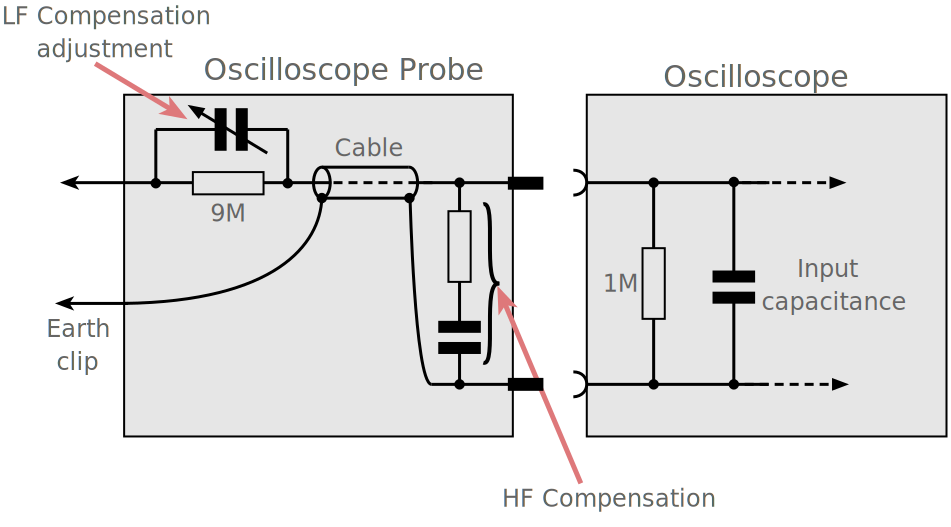

# Open collector

behaves like a switch that is either connected to ground or disconnected

# Zero-ohm link

* typically 10–50 mΩ
* For trace requiring large trace current, better use a 0.001-0.003-ohm resistor, rather than the generic "zero-ohm" resistor in which the actual resistance may be higher, and tolerance is not given    

* Usage:
  * Jumper
  * Selective connections
    * R40, R41, R44, R45 in [06-22332B schematic](C:\Users\aeemcng\Documents\Cone\2019-07-03_burnt_5M_cam\06-22332_@_A1_NOTED.pdf)  
      
      * 0 ohm between USB port and CY7C68013A USB Peripheral Controller
      * not a jumper
        * either use 0 ohm resistor / the U6 choke, actually U6 is absent in the real product
  * Current sensing before production
    * [StackExchange](https://electronics.stackexchange.com/questions/42756/what-is-the-usage-of-zero-ohm-miliohm-resistor)
    * provide a current measurement point. During development and testing you can place a low resistance shunt resistor to measure the current, and for production replace it with a zero ohm jumper. Then you don't have to cut traces to insert the shunt resistor in the circuit. Probably less applicable, since you should have measured the current before creating the final PCB, but for very low current circuits the layout and PCB material may matter, and then you do want to measure on the final board.

# Shunt

[StackExchange](https://electronics.stackexchange.com/questions/42756/what-is-the-usage-of-zero-ohm-miliohm-resistor)

* Bypassing the sense resistor with a capacitor - maybe 10 uF or 100 uF depending on circuit
  * further reduce impact on the circuit
* Use an eg 0.1 Ohm shunt,  
  feed the voltage via a series 1k resistor to the meter, and  
  a say 10 uF across the meter terminals.
  * reduce affected by high frequency noise

# Common-mode choke

* passing differential-mode (DM, equal but opposite) currents, while blocking common-mode (CM) currents
  * The magnetic flux produced by DM currents in the core tend to cancel each other due to negative coupled windings
  * little inductance or impedance to DM currents -> cone won't saturate -> maximum current rating is determined by the heating effect of the winding resistance only
  * Opposingly, CM currents see a high impedance

* L6 in [06-22332C schematic](C:\Users\aeemcng\Documents\Cone\2019-07-03_burnt_5M_cam\06-22332C_wrong_version\64-22332C_X_X1-CIRCUIT.sch)  
  
  * between 3.3V and GND from connector and 3.3V and GND being actually used

# Use thick ground plate to short CHGND together

* In [06-22332B schematic](C:\Users\aeemcng\Documents\Cone\2019-07-03_burnt_5M_cam\06-22332_@_A1_NOTED.pdf)
* between the case of USB port and CHGND

# CHGND = Chassis ground

## Signal format

* [Van Eck phreaking](https://en.wikipedia.org/wiki/Van_Eck_phreaking)
* [Data strobe encoding](https://en.wikipedia.org/wiki/Data_strobe_encoding)
  * XOR always equal to clock signal

### I2C

* more peripheral -> more capacitance -> longer rise time -> slower bus speed

#### Inertial delay

[Xilinx forum](https://forums.xilinx.com/t5/Networking-and-Connectivity/Set-INERTIAL-DELAY-in-IIC-module/td-p/495248)

* parameters in Xilinx AXI IIC IP
  * e.g. AXI clock = 100MHz, C_SCL_INERTIAL_DELAY = 5, delay = 10ns * 5 = 50ns
* pulse rejection & delay inside
* SCL delay longer than SDA -> undesirable
* SDA delay longer than SCL -> increase hold time, may eliminate errorneous starts/stops

### USB

[USB in a NutShell](https://beyondlogic.org/usbnutshell/usb1.shtml)

#### Electrical

Pin Number | Cable Colour | Function
-----------|--------------|---------
1 | Red | V_BUS (5 volts)
2 | White | D-
3 | Green | D+
4 | Black | Ground

* D+ and D-
  * both differential and single ended
    * differential:
      * 'J' = diff. '0' = D- - D+ > 200mV
      * 'K' = diff. '1' = D+ - D- > 200mV
      * On low and full speed devices, a differential ‘1’ is transmitted by pulling D+ over 2.8V with a 15K ohm resistor pulled to ground and D- under 0.3V with a 1.5K ohm resistor pulled to 3.6V. A differential ‘0’ on the other hand is a D- greater than 2.8V and a D+ less than 0.3V with the same appropriate pull down/up resistors. 
    * single ended:
      * SE0 D+ & D- < 0.3V (low) for > 10ms
* characteristic impedance: 90 ohms +/- 15%
* High Speed (480Mbits/s) mode uses a 17.78mA constant current for signalling to reduce noise. 
* Speed Identification: pulling D+/D-
  * based on speed
    * 1.5k ohm pull up D+: full speed
    * 1.5k ohm pull up D-: low speed
    * High speed devices will start by connecting as a full speed device
  * identify existance of USB device too
  * some ICs uses built-in resistor in silicon -> can turn on/off
    * off before ready for initialising the USB function
* Power
  * Low-power bus powered functions
    * work under 4.40V - 5.25V
    * 1 unit load = 100mA
  * High-power bus powered functions
    * detected and enumerated under 4.40V - 5.25V
    * work under 4.75V - 5.25V
    * 5 unit load = 500mA
  * Self-powered functions
    * 1 unit load from bus = 100mA
      * identification
  * Never drive V_BUS on its upstream facing port
  * Suspend Current 500uA per unit load
    * Sth drawing currents:
      * pull up resistors
      * linear regulator's quiescent current
      * MCU's clock
    * Suspend Mode
      * no activity for 3 ms
        * has to drawn less than suspend current in further 7 ms
      * send frame packet to keep alive
        * high speed: micro-frames every 125.0 µs ±62.5 ns
        * full speed bus: frame sent down each 1.000 ms ±500 ns
        * low speed bus: keep alive which is a EOP (End of Packet) every 1ms only in the absence of any low speed data
    * Signalling rate
      * High speed: 480.00Mb/s ± 500ppm
      * Full speed: 12.000Mb/s ±0.25% or 2,500ppm
      * Low speed: 1.50Mb/s with ±1.5% or 15,000ppm
        * therefore resonator is acceptable for low speed only

* Packet
  * Include diff. fields
    * Sync, PID, ADDR, ENDP, CRC, EOP
    * No any types contains all fields
  * Types: Token, Data, Handshake Packets
    * Token: In, Out, Setup
    * Data: Data0, Data1
    * HandShake: ACK, NAK, STALL
* Transfer
  * Control Transfer
    * Setup, Data, Status Stages
  * Interrupt Transfer
  * Bulk Transfer
  * Isochronous Transfer

#### Class

[USB-IF](https://www.usb.org/defined-class-codes)

* Application Specific (FEh)
* Vendor Specific (FFh)

### PCI Express = PCIe

* _Referenece: [Wikipedia](https://en.wikipedia.org/wiki/PCI_Express#Pinout)_

Lane        | Total Pin number
------------|-----------------
before notch| 11
PCIe ×1     | 18
PCIe ×4     | 32
PCIe ×8     | 49
PCIe ×16    | 82

## Signal integrity

### high speed connection

* not much design difference
* ESD protector

### cable

#### USB shielding & termination

* attenuation
* insertion loss
* return loss
* skew rate
* EFT test
* EMC resortion lost
* Eye pattern
* instrument: network analyzer
  * source of error
    * fixture loss calibration
    * setup parameter
      * rise time
      * IF resolution
      * sampling frequency

### Transmission line model

Ref: *ELEC3342 Ch. 8*

transmission line effect: ringing in transmission

apply when:

* rise time ~= path delay
  * depends on:
    * length
    * speed of light in the medium

#### Characteristic Impedance

* ratio between voltage and current waves that travel down the channel
* uniform, lossless line: Z_0 = sqrt(L/C)
* typical: 50-75 ohm

Ref: *[What is Characteristic Impedance? - Eric Bogatin](..\Hello_references\BTS002_Characteristic_Impedance_NOTED.pdf)*

* Z_0 = 1/(C_L v), C_L = C of the line, v = speed of the signal

#### Reflections

* occurs when unmatched line with source/load
* Γ = (Z_L - Z_0)/(Z_L + Z_0)
* V_reflected = Γ V_incident

#### Termination

* Source termination: invalid levels momentarily
  * e.g. P2P connection
* Load termination: power dissipation exists
  * e.g. multi-drop bus
* Both end
  * e.g. bus with multiple receivers and drivers <- prevent reflections from either end

### Intersymbol Interference

* bit affected by bit before
* sources:
  * Next bit before reflections damp out
    * unterminated transmission line: mim. bit time = several round trips
  * dispersion <- nonzero line resistance
  * crosstalk
    * capacitance to its neighbour
    * noise on non-switching wires
      * if victim is floating: 
      * if victim is driven: 
    * increased delay on switching wires
  * ground bounce <- nonzero return path impedance

## High-speed I/O

Ref: *ELEC3342 Ch. 8*

* transmit data > flight time
* high-impedance driver + load termination?
* low-impedance driver + source termination?

### Repeater

* Reason: R, C proporational to l -> RC delay proporation to l^2
  * break long wires into segments -> l/N
* buffer or inverter

## ESD

Ref: *ELEC3342 Ch. 8*

* current limiting resistor
* diode clamps -> over/under-voltage surge
* thin gate oxides

### dipole effect

analog GND <-> power supply <-> digital GND
-> effective antenna
decoupling cap/filter

### EMI mitigration techniques

1. striplines
2. microstrip
3. ...

* avoid via for high speed
  * small via = high inductance
  * application specific
* slower rising edge
* board guarding
  * if multiple GND domains, each use guarding if high speed

## Passive Delay Line

[Passive Delay Line Design Considerations](http://www.rhombus-ind.com/dlcat/app1_pas.pdf
)

A Passive Delay Line is a special purpose Low Pass Filter designed to delay (phase shift) the input signal by a specifiedincrement of time, and is composed of series inductors andshunt capacitors with values dictated by the line impedance.

## Instruments

### Oscilloscope

* Probe  
  
