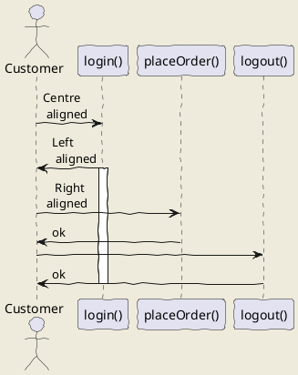
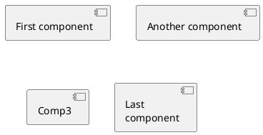
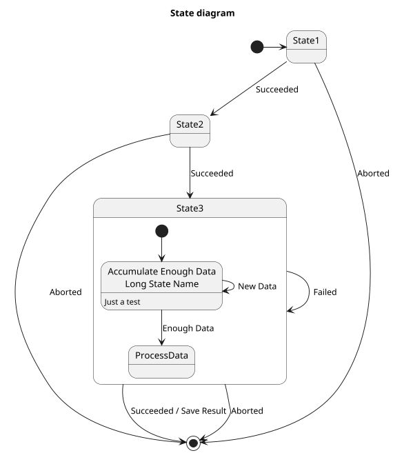
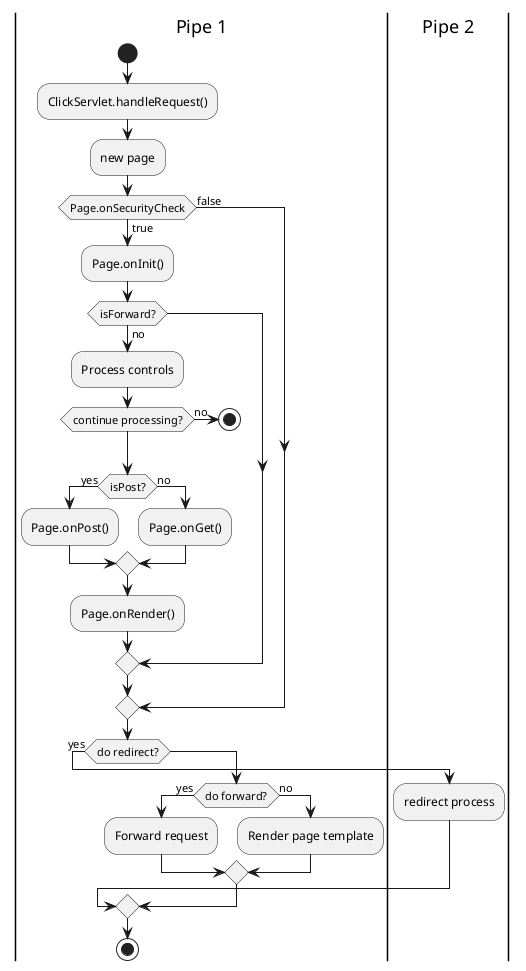
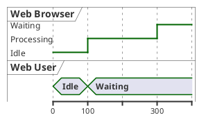
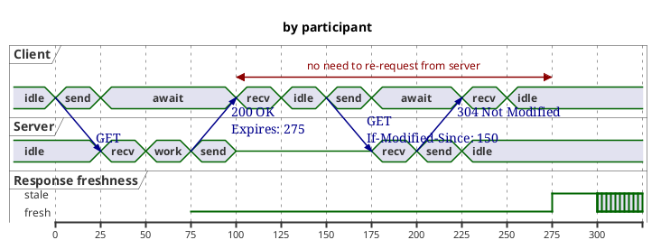

# Heading

## Sub-heading

### Another deeper heading

Paragraphs are separated
by a blank line.

Two spaces at the end of a line leave a  
line break.

Text attributes _italic_, *italic*, __bold__, **bold**, `monospace`, ~~strikethrough~~.

Horizontal rule:

---

Bullet list:

* apples
* oranges
* pears

Numbered list:

  1. apples
  2. oranges
  3. pears

A [link](http://example.com).

A [link to heading](#Sub-heading)

## UML: PlantUML plugin

* Filename extension: `.wsd`

* [Gantt Diagram - PlantUML](https://plantuml.com/gantt-diagram)

### Component Diagram

* [Component Diagram - PlantUML](https://plantuml.com/component-diagram)

### State diagram

### Flow (Activity) diagram

  * [New Activity Diagram Beta syntax and features](https://plantuml.com/activity-diagram-beta)

### Timing diagram

* [Timing Diagram -PlantUML](https://plantuml.com/timing-diagram)

