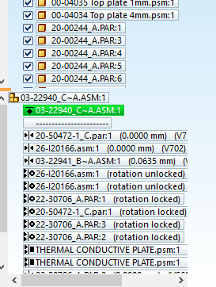
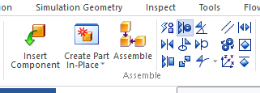
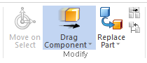
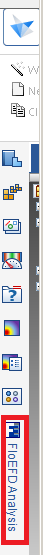
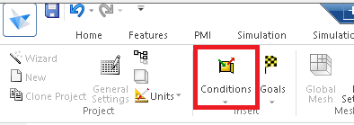

# Solid Edge

## Getting Started

* Suggested by CAD Group Ko Win Yin, Yanko
  > For viewing the user guide of SE2019, please follow the below steps:
  > 1)      Start SE 
  > 2)      Click ‘Learn Solid Edge’    (located on the right side)
  > 3)      Click ‘Choose a learning path’
  > 
  > Here are the basic topics suggested:
  > Part:
  > -          Create a part
  > -          Feature Modeling
  > -          Modify a model
  > -          Create a sheet metal part
  > -          Working with 2D geometry
  > -          Engineering tools
  > Assembly:
  > -          Assemble parts
  > -          Engineering tools
  > Drawing 
  > -          Drawing production
  > -          Parts lists and tables
  > -          Dimensions
  > -          Annotations
  > -          Engineering tools

## Parts

* Draw a box
  * Draw a rectangle (select a ref. plane & enter dimension) => `Extrude`

* Hollow solid
  * https://community.sw.siemens.com/s/question/0D54O000061xdFeSAI/best-way-to-hollow-a-solid
  * draw a box => `Thin wall` and do not select a face to be left open
    * `Thin wall` icon (near `extrude`)
    * Not to select a face: select a feature => press `Thin wall` => enter thickness

## Assembly

* [Solid Edge Assembly Best Practices by Tushar Suradkar - Siemens](https://blogs.sw.siemens.com/solidedge/solid-edge-assembly-best-practices/)

* Relationship
  * can view under Pathfinder (the assembly tree)  
    
  * 1st part added automatically has `ground` relationship, which is the root of every other relationship  
    
  * add new condition with `Home` -> `Assembly` -> desired relationship on the right, e.g. `Axial Align`, `Mate`  
    

  * ground
    * Drag the components to wherever you want, to press ground

* Move components (underconstrainted / grounded parts)
  * `Home` -> `Drag components`  
    

* Copy whole assembly with related files
  * Right click in Windows Explorer -> `Open with Design Manager` -> `Pack-and-go` (Top toolbar in the field `Action`)

* Export BoM to .txt / .rtf / Excel
  1. Expand PathFinder to the format you'd like to export
  2. `Tools` -> `Reports` in the `Assistants` column
    * Among: `All parts in the assembly`
    * `Bill of materials`: include children too
    * `Part list`: only 1st level
  3. `Save as...` / `Copy` and paste into Excel

* Alternate Assembly
  * in case the tab is not found, select one of the tab on the left, then click the arrow. And you will find it.

## Drawing

* Right click a part in an assembly -> `Create Drawing...`
  * What is this?

* Input attributes
  * [ECO.md](..\ASMPT\ECO.md)
    * #Input attributes

* Export BoM
  * [How to Create an Expanded Parts List in Solid Edge and Copy to Excel - PROLIM](https://www.prolim.com/how-to-create-an-expanded-parts-list-in-solid-edge-and-copy-to-excel/)

  1. Right click the Part list -> `Copy contents` -> `List control` tab -> 
  2. Copy to spreadsheet

  * To change the part list format (e.g. expanded list)
    1. Right click the Part list -> `Properties`
    2. Select the `Exploded list`

* Part List & Bubbles
  * 

* Add 2D views
  * `View wizard` -> select the suitable .cfg

* Explode
  1. Open .asm
  2. `Tools` -> `ERA`
  3. `Explode` / `Auto-explode`
    * Assembly within an assembly cannot be exploded unless there is a logo  near its name on PathFinder (not sure what does it means)
      * Click `Drag Component` and drag the assembly,  will appear on the assembly 
  4. New drawing: `New` -> `Drawing of active model`
  5. `Home` tab -> `View Wizard`

* Edit explode view
  1. Open .asm -> `Tools` -> `ERA`
  2. `Display Configurations` -> select the config -> `Apply`
     * some config is only visible in ERA
  3. Apply
  4. Modify
    * e.g. click the parts -> `Bind` in `Modify tab` -> `Explode`
  5. `Save Display Configurations` 
  6. Open .dft -> right-click view -> `update`

* Change D. Rev. without ASM Template Setup
  1. `Data Management` -> `File Properties` -> select document revision, then change the value
  2. `Update View`

## Flow Analysis - FloEFD

* Click Flow Analysis Tab -> Wizard -> After finish, click the "F" logo for FloEFD Analysis tree
  * 

* `Check Geometry` to see if the model is fluid tight, holes should be covered with lids
  * `Tools` -> `Create lids`, the tools will create lids on every holes of the selected plane, theωn you can add conditions over these lids
  * `Tools` -> `Leak Tracking`, select 2 faces then click `Find Connection` at the bottom, leaking faces will be shown under `Track Faces`

* Add condition
  * 
  * when selecting boundary conditions (e.g. holes in the case), select the inner face
  * You can select the existing items in the Analysis tree if the parts / faces to be selected are the same

  * Solid Materials
    * PCB (Axisymmetrical/Biaxial) -> Radial (In-plane) must faster than axial thermal conductivity
    * Remember to set the right axis in `Anisotropy`

* QuickPick (e.g. adding `condition`)
  * hover over the parts, wait until the right click logo appear, then right click

* Outer Wall

* Component Control

* Error: `Check Geometry` -> cavities without flow conditions
  * cause: no fluid flow, e.g. w/o boundary condition with atm pressure / fan / ...

## Problem

### No ASM customized templates
http://ahknts138/PhysicalGoodsReceiveSystem/EngineerEORPartsCollection .aspx
* error msg: Part Template file not found.  Make sure that your template file location is set properly. Go to solid Edge Options\Helpers and click Set Default Templates
* fix:
  > Please run:
  > 
  > `\\ahkex\NETLOGON\engineering.bat` to connect I, U, X and K drives.
  > 
  > Then close SE (if opened), run:
  > 
  > `\\ahkex.asmpt.com\homedrive\SYS\APPLCN\APPINI\00_NewCAD\64bit\Win10_64_New_CAD.bat` to reset ASM SE setting.
  > 
  > These should set the ASM customized templates for you, which are different from the built-in templates in SE.
