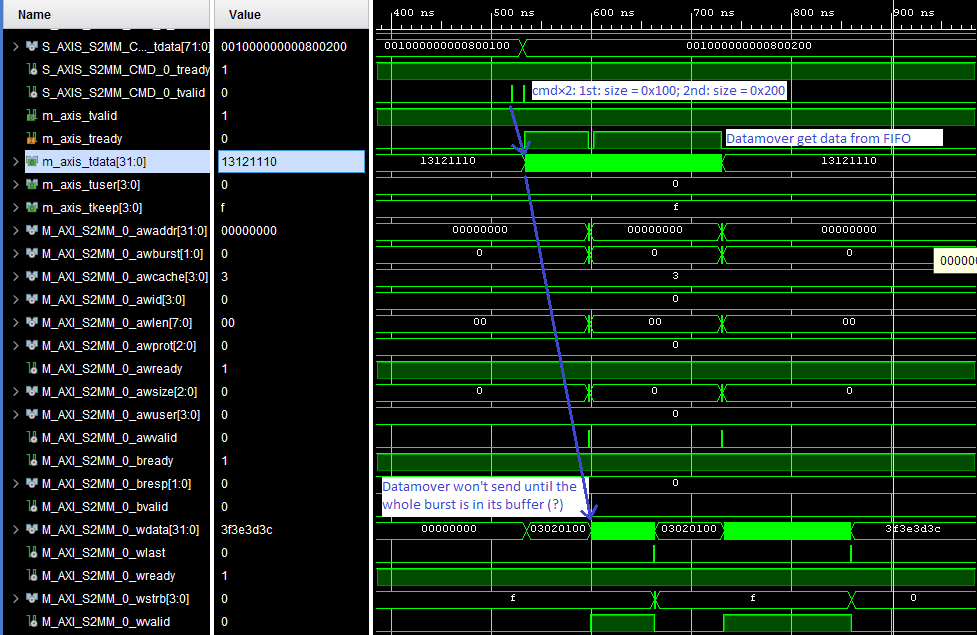

# Xilinx

## IP

* Video Frame Buffer
  * PG278

* FIFO Generator
  * PG057
  * Data Threshold Parameters <- Interrupt and Occupancy
  * Suggested selection for best performance, power and area is:
    * Shift Register for shallow (<= 32) depth
    * Distributed RAM for shallow (<=128) depth
    * Built-in FIFO for deep (>32) depths
  * Signal:
    * Write Acknowledge: for handshaking, indicates that wr_en during the prior clock cycle succeeded

* Video Test Pattern Generator
  * Register
    * Control
      * start, auto_restart
      * active height / width
      * background pattern: pass-through / solid / ramp / pattern
      * foreground pattern: box / cross hair
      * mask
      * colour format: RGB, YUV
    * can be programmed dynamically
      * except image size
      * for toggling passthrough, need reset afterwards

### AXI

* AXI4-Stream Infrastructure
  * PG085
  * [閱讀筆記：pg085 AXI4-Stream infrastructure](https://blog.csdn.net/xdczj/article/details/72058100)
  * AXI4-Stream Subset Converter: 10-bit to 8-bit

* AXI DMA
  * Multi Channel Support (up to 16)
  * Throughtput:
    * MM2S: 99.76%
    * S2MM: 74.64%
  * Status Register
    * Interrupt on Complete
  * `u32 XAxiDma_SimpleTransfer(XAxiDma *InstancePtr, UINTPTR BuffAddr, u32 Length, int Direction)`
    * DMA_TO_DEVICE need MM2S, vice versa

* Video DMA (VDMA)
  * DMA with frame buffering, 2-D Transfer etc.

* Datamover
  * Datamover won't send data out until the whole burst is in its buffer (?)
    * after buffering -> `addr_req_posted` = '1' and `s2mm_awvalid` = '1'
      * difference is that `addr_req_posted` only stay for 1 cycle but `s2mm_awvalid` stay until `s2mm_awready` = '1'
    * [source](doc/Datamover_buffer_test/)
    * 

* AXI Interconnect
  * register slice (None, Outer, Auto, Outer and Auto)
    * [How to use Ppeline Stages in Block design to overcome negative slack? - Xilinx Forum](https://forums.xilinx.com/t5/Timing-Analysis/How-to-use-Pipeline-Stages-in-Block-design-to-overcome-negative/m-p/893679#M15146)
    * activate register slice on slave side only

### MIPI CSI-2 Rx Subsystem

* 8-lane is not supported !

* PL GTH transceivers are used
  * 0.5 - 16.375 Gb/s
  * serial-to-parallel
  * GTY for even higher speed, but 0 in ZU4CG
  * 16 in ZU4CG, 0 in ZU3CG
  * low-poer mode (LPM)
  * out-of-band (OOB) for low-speed

* Shared logic btw subsystems
  * comprises a PLL and some BUFGs

* I/O
  * has I/O Planner
  * PG232 P.42 (I/O Planning)
    * HP/HR I/O Bank
    * lane should be selected contiguouly, otherwise RX_BITSLICE is needed for clock/strobe propagation
    * All lanes should be in the same HP Bank
      * same applies for multiple subsystems with the same shared clocking resources

* clock
  * `lite_aclk` for AXI-Lite
  * `video_aclk` sybsystem clock, for video_out (AXI-Stream)?
    * max: 250MHz
    * video_aclk1(MHz) = Line Rate(Mb/s) * Data Lanes / 8 / 4
      video_aclk2(MHz) = (Line Rate(Mb/s) * Data Lanes) / Pixel Mode / Number of Bits Per Pixel
      The effective minimun required video clock is:
      video_aclk(MHz) = Max {video_aclk1 , video_aclk2}
  * `dphy_clk_200M`: Clock for D-PHY core. Must be 200 MHz.
  * `clkoutphy_out`, `clkoutphy_in`: Shared Logic
  * `rxbyteclkhs`: 1/8 of line rate
  * PG232 Clocking (P.44)
    * relationship between line rate and video clock

* Configuration parameters
  * D-PHY Register Interface: Select to enable the register interface for the MIPI D-PHY core
  * Enable Deskew Detection: Select to enable Deskew sequence detection and centre alignment of clock and data lanes in MIPI D-PHY
    * for line rates > 1.5 Gb/s
  * Line Buffer Depth: 128 - 16384

* register
  * 3 regions
    * controller
      * Core Configuration (CCR) (0x00): reset and enable
      * Protocol Configuration Register (0x04): number of lanes
      * Core Status (0x10):
        * Packet count (!)
        * Short packet FIFO (?) full/empty
      * Interrupt - ISR, IER
        * Error
        * FIFO full/empty
        * Buffer full
        * Frame received bit (!)
      * Status
        * MIPI Lane
          * stop state (0x3C)
          * Image Information (0x40 - 0x4C)
            * 2 registers for each virtual channel (VC)
              * 1 sensor 1 VC I guess, so only VC0 is used I guess
            * line count (no. of long packets) (!)
            * byte count (!)
            * data type
        * Short Packet FIFO (0x30)
          * 31-deep
        * VCX Frame Error (0x34)
    * IIC
    * D-PHY core (PG202)
      * `INIT`
      * `CL_STATUS`
      * `ESC_TIMEOUT`

* MIPI D-PHY IP (PG202)
  * Clock frequencies
    * `core_clk` = `dphy_clk_200M` in subsystem IP
    * 200 MHz
    * `create_clock -name core_clk -period 5.000 [get_ports core_clk]`

* Video Format Bridge
  * pixel packing: UG934
  * have a latency (UG232 P. 16 - Video Format Bridge (VFB) latency)
  * filter all except RAW8 and User Defined Data types
    * ????? How to select data types?

* API
  * `u32 XCsiSs_Configure(XCsiSs *InstancePtr, u8 ActiveLanes, u32 IntrMask)`
    1. enable interrupt
    2. soft reset
    3. set active lane
    4. clear reset

  * `XCsi_Activate()`
    * interrupt and reset
  * `XDphy_Activate()`
    * Set enable bit and reset disable bit on control register (0x00)

## Vivado

### Tcl

* `source something.tcl`

* Open .dsa -> generate a Vivado project
  * open_dsa C:/<your_path>
    * path must use "/" not "\"
    * Problem: Failed to create file...
      * [Xilinx Forum](https://forums.xilinx.com/t5/SDSoC-Environment-and-reVISION/Open-dsa-issue-in-Vivado/td-p/856288)
      * Solution: `cd` to a short path e.g. `C:/Users/aeekycheung`
  * write block design to `.tcl`
    * `write_bd_tcl my_block_design.tcl`
      * change `design_name` in the .tcl file if necessary
* Save Resource Utilization as spreadsheet
  * [Xilinx Forum](https://forums.xilinx.com/t5/Vivado-TCL-Community/vivado-export-utilization-information-issue/td-p/712087)
  * `report_utilization -name util_1 -spreadsheet_file util_1.xlsx`

### Constraints

* .xdc
* auto-generated (e.g. IP specific):
  * Sources -> Compile Order -> Constraints

### Zynq

* vector in pl_ps_irq0
  * [Xilinx](https://www.xilinx.com/support/answers/55703.html)
  * use Concat IP

### Debugging

* ILA
  * save waveform
    * `write_hw_ila_data my_data.ila [upload_hw_ila_data hw_ila_1]`
  * load waveform
    * `display_hw_ila_data [read_hw_ila_data C:/Users/aeekycheung/Downloads/8x_128bit_32burst_200MHz_but_wait_for_hours.ila]`
  * trigger at startup
    1. Bring up the ILA Dashboard
    2. Export trigger register map file: `run_hw_ila -file ila_trig.tas [get_hw_ilas hw_ila_1]`
    3. Open implemented design
    4. Apply trigger setting: `%apply_hw_ila_trigger ila_trig.tas`
       * If error (ILA core has been flattened during synthesis), regenerate your design and force synthesis to preserve hierarchy for the ILA core
* VIO
  * Virtual input and output
* JTAG-to-AXI
  * `reset_hw_axi [get_hw_axis hw_axi_1]`
  * Read
    * `create_hw_axi_txn read_txn [get_hw_axis hw_axi_1] -type READ -address 00000000 -len 4`       * `-len 4`: sets the AXI burst length to 4 words
    * `run_hw_axi [get_hw_axi_txns read_txn]`
  * Write
    * `create_hw_axi_txn write_txn [get_hw_axis hw_axi_1] -type WRITE -address 00000000 \
-len 4 -data {11111111_22222222_33333333_44444444}`
      * `-data {11111111_22222222_33333333_44444444}`: The -data direction is LSB to the left (i.e., address 0) and MSB to the right (i.e., address 3)
    * `run_hw_axi [get_hw_axi_txns write_txn]`
* Memory Calibration Debug (internal BRAM)

### Synthesizable code

* ug901-vivado-synthesis

* primitives
  * ug974
  * IBUFG, pull-up, pull-down, IBUFDS, BUFR...
  * `BUFG`
    * General Clock Buffer
    * high-fanout
    * usually used in clock nets, sets, resets and clock enables
  * `IBUF`
    * Input Buffer
  * D-flip-flop
    * `FDCE`, `FDPE`, `FDRE`, `FDSE`

### IP Integrator

* Generate Output Products
  * Global
    * disable out-of-context synthesis
  * Out of context per IP
    * A design checkpoint file (DCP, including netlists) is created for every IP used in the BD, IP cache can be used
    * significantly reduce synthesis run times
  * Out of context per Block Design
    * generating a design checkpoint for the BD itself, let you synthesize the complete BD separately from the top-level design
    * generally selected when third-party synthesis is used

### AXI Template

* Create using Tools -> Create and Package New IP -> Create a new AXI4 peripheral

* ```vhdl
      -- Initiate AXI transactions
      INIT_AXI_TXN : in std_logic;
      -- Asserts when transaction is complete
      TXN_DONE : out std_logic;
      -- Asserts when ERROR is detected
      ERROR : out std_logic;

      -- Global Clock Signal.
      M_AXI_ACLK : in std_logic;
      -- Global Reset Singal. This Signal is Active Low
      M_AXI_ARESETN : in std_logic;

      -- Master Interface Write Address ID
      M_AXI_AWID : out std_logic_vector(C_M_AXI_ID_WIDTH-1 downto 0);
      -- Master Interface Write Address
      M_AXI_AWADDR : out std_logic_vector(C_M_AXI_ADDR_WIDTH-1 downto 0);
      -- Burst length. The burst length gives the exact number of transfers in a burst
      M_AXI_AWLEN : out std_logic_vector(7 downto 0);
      -- Burst size. This signal indicates the size of each transfer in the burst
      M_AXI_AWSIZE : out std_logic_vector(2 downto 0);
      -- Burst type. The burst type and the size information, 
      -- determine how the address for each transfer within the burst is calculated.
      M_AXI_AWBURST : out std_logic_vector(1 downto 0);
      -- Lock type. Provides additional information about the
      -- atomic characteristics of the transfer.
      M_AXI_AWLOCK : out std_logic;
      -- Memory type. This signal indicates how transactions
      -- are required to progress through a system.
      M_AXI_AWCACHE : out std_logic_vector(3 downto 0);
      -- Protection type. This signal indicates the privilege
      -- and security level of the transaction, and whether
      -- the transaction is a data access or an instruction access.
      M_AXI_AWPROT : out std_logic_vector(2 downto 0);
      -- Quality of Service, QoS identifier sent for each write transaction.
      M_AXI_AWQOS : out std_logic_vector(3 downto 0);
      -- Optional User-defined signal in the write address channel.
      M_AXI_AWUSER : out std_logic_vector(C_M_AXI_AWUSER_WIDTH-1 downto 0);
      -- Write address valid. This signal indicates that
      -- the channel is signaling valid write address and control information.
      M_AXI_AWVALID : out std_logic;
      -- Write address ready. This signal indicates that
      -- the slave is ready to accept an address and associated control signals
      M_AXI_AWREADY : in std_logic;

      -- Master Interface Write Data.
      M_AXI_WDATA : out std_logic_vector(C_M_AXI_DATA_WIDTH-1 downto 0);
      -- Write strobes. This signal indicates which byte
      -- lanes hold valid data. There is one write strobe
      -- bit for each eight bits of the write data bus.
      M_AXI_WSTRB : out std_logic_vector(C_M_AXI_DATA_WIDTH/8-1 downto 0);
      -- Write last. This signal indicates the last transfer in a write burst.
      M_AXI_WLAST : out std_logic;
      -- Optional User-defined signal in the write data channel.
      M_AXI_WUSER : out std_logic_vector(C_M_AXI_WUSER_WIDTH-1 downto 0);
      -- Write valid. This signal indicates that valid write
      -- data and strobes are available
      M_AXI_WVALID : out std_logic;
      -- Write ready. This signal indicates that the slave
      -- can accept the write data.
      M_AXI_WREADY : in std_logic;

      -- Master Interface Write Response.
      M_AXI_BID : in std_logic_vector(C_M_AXI_ID_WIDTH-1 downto 0);
      -- Write response. This signal indicates the status of the write transaction.
      M_AXI_BRESP : in std_logic_vector(1 downto 0);
      -- Optional User-defined signal in the write response channel
      M_AXI_BUSER : in std_logic_vector(C_M_AXI_BUSER_WIDTH-1 downto 0);
      -- Write response valid. This signal indicates that the
      -- channel is signaling a valid write response.
      M_AXI_BVALID : in std_logic;
      -- Response ready. This signal indicates that the master
      -- can accept a write response.
      M_AXI_BREADY : out std_logic;

      -- Master Interface Read Address.
      M_AXI_ARID : out std_logic_vector(C_M_AXI_ID_WIDTH-1 downto 0);
      -- Read address. This signal indicates the initial
      -- address of a read burst transaction.
      M_AXI_ARADDR : out std_logic_vector(C_M_AXI_ADDR_WIDTH-1 downto 0);
      -- Burst length. The burst length gives the exact number of transfers in a burst
      M_AXI_ARLEN : out std_logic_vector(7 downto 0);
      -- Burst size. This signal indicates the size of each transfer in the burst
      M_AXI_ARSIZE : out std_logic_vector(2 downto 0);
      -- Burst type. The burst type and the size information, 
      -- determine how the address for each transfer within the burst is calculated.
      M_AXI_ARBURST : out std_logic_vector(1 downto 0);
      -- Lock type. Provides additional information about the
      -- atomic characteristics of the transfer.
      M_AXI_ARLOCK : out std_logic;
      -- Memory type. This signal indicates how transactions
      -- are required to progress through a system.
      M_AXI_ARCACHE : out std_logic_vector(3 downto 0);
      -- Protection type. This signal indicates the privilege
      -- and security level of the transaction, and whether
      -- the transaction is a data access or an instruction access.
      M_AXI_ARPROT : out std_logic_vector(2 downto 0);
      -- Quality of Service, QoS identifier sent for each read transaction
      M_AXI_ARQOS : out std_logic_vector(3 downto 0);
      -- Optional User-defined signal in the read address channel.
      M_AXI_ARUSER : out std_logic_vector(C_M_AXI_ARUSER_WIDTH-1 downto 0);
      -- Write address valid. This signal indicates that
      -- the channel is signaling valid read address and control information
      M_AXI_ARVALID : out std_logic;
      -- Read address ready. This signal indicates that
      -- the slave is ready to accept an address and associated control signals
      M_AXI_ARREADY : in std_logic;

      -- Read ID tag. This signal is the identification tag
      -- for the read data group of signals generated by the slave.
      M_AXI_RID : in std_logic_vector(C_M_AXI_ID_WIDTH-1 downto 0);
      -- Master Read Data
      M_AXI_RDATA : in std_logic_vector(C_M_AXI_DATA_WIDTH-1 downto 0);
      -- Read response. This signal indicates the status of the read transfer
      M_AXI_RRESP : in std_logic_vector(1 downto 0);
      -- Read last. This signal indicates the last transfer in a read burst
      M_AXI_RLAST : in std_logic;
      -- Optional User-defined signal in the read address channel.
      M_AXI_RUSER : in std_logic_vector(C_M_AXI_RUSER_WIDTH-1 downto 0);
      -- Read valid. This signal indicates that the channel
      -- is signaling the required read data.
      M_AXI_RVALID : in std_logic;
      -- Read ready. This signal indicates that the master can
      -- accept the read data and response information.
      M_AXI_RREADY : out std_logic
  ```

* input worth noting
  * M_AXI_ARESETN, INIT_AXI_TXN
  * start_single_burst_write, start_single_burst_read

* init_txn_pulse
  * init_txn_pulse <= (not init_txn_ff2) and init_txn_ff;
    * init_txn_ff <= INIT_AXI_TXN;
    * init_txn_ff2 <= init_txn_ff;

* Write Address
  * axi_awvalid
    * '1' when
      * axi_awvalid = '0' and start_single_burst_write = '1'
    * '0' when
      * reset (M_AXI_ARESETN = '0' or init_txn_pulse = '1')
      * M_AXI_AWREADY = '1' and axi_awvalid = '1'
        * transaction is accepted -> de-assert

  * axi_awaddr
    * increment each time by `burst_size_bytes`
      * `burst_size_bytes <= std_logic_vector( to_unsigned((C_M_AXI_BURST_LEN * (C_M_AXI_DATA_WIDTH/8)),C_TRANSACTIONS_NUM+3) );`

      ```vhdl
      if (M_AXI_AWREADY= '1' and axi_awvalid = '1') then
        axi_awaddr <= std_logic_vector(unsigned(axi_awaddr) + unsigned(burst_size_bytes));
      end if;
      ```

* Write Data
  * > The simpliest but lowest performance would be to only issue one address write and write data burst at a time.
    <!-- ? What does it mean? -->

  * axi_wvalid
    * '1' when
      * axi_wvalid = '0' and start_single_burst_write = '1'
    * '0' when
      * reset
      * wnext = '1' and axi_wlast = '1'

  * axi_wlast

  * write_index
    * > Burst length counter

  * axi_wdata
    * need to program your own stuff
    <!-- TODO -->

* Write Response (B)
  * axi_bready
  * write_resp_error

* Read Address

* Read Data (and Response)

* example
  * generic & constant
    * C_M_AXI_BURST_LEN : integer := 16;
      * Burst Length. Supports 1, 2, 4, 8, 16, 32, 64, 128, 256 burst lengths
    * C_M_AXI_DATA_WIDTH : integer := 32;
      * Width of Data Bus
    * constant  C_NO_BURSTS_REQ  : integer := (C_MASTER_LENGTH-clogb2((C_M_AXI_BURST_LEN*C_M_AXI_DATA_WIDTH/8)-1));
      * total number of burst transfers is master length divided by burst length and burst size
  * signal write_burst_counter : std_logic_vector(C_NO_BURSTS_REQ downto 0);
  * 
  * write_burst_counter
    * ++ when rising_edge(M_AXI_ACLK) and axi_wvalid = '1'
    * for writes_done only
  * read_burst_counter
  * MASTER_EXECUTION_PROC
    * FSM
      * IDLE:
        * wait for init_txn_pulse -> INIT_WRITE
      * INIT_WRITE:
        * generate start_single_burst_write
        * wait for writes_done -> INIT_READ
      * INIT_READ:
        * wait for reads_done -> INIT_COMPARE
      * INIT_COMPARE:
        * IDLE

  * burst_write_active
    * '1' when start_single_burst_write = '1'
    * only used in FSM above
  * writes_done
    * only used in FSM above

### Block Diagram

* Ports (Ctrl+L) VS External Interfaces (Interface Ports, Ctrl+K)
  * [Xilinx Forum](https://forums.xilinx.com/t5/Processor-System-Design/Create-interface-port-and-create-port/td-p/747456)
  * Ports: link from the block diagram to a (set of) pins in your IO xdc
  * Interfaces: = Ports, but with some constraint, or base on some standards (e.g. AXI, DDR, I2C)

### Synthesis

* Synthesized Design
  * Open Synthesized Design ->Repport Timing Summary
  * Window -> I/O Port

### Timing

* Synthesis / Implementation -> Reports -> Timing -> Report timing summary
  * Showing critical path:
    1. Press the link of Worst Negative Slack (WNS)
    2. Right click the path and select "Schematic"

## Xilinx SDK

* add include folder
  * [Xilinx forum](https://forums.xilinx.com/t5/Embedded-Development-Tools/Xilinx-SDK-adding-folder-with-source/td-p/808242)
  * Properties -> "C/C++ Build" -> "setting" -> "Tool setting" -> compiler -> directories -> Include Paths

* `psu_init.tcl`
  * init Zynq PS setting
    * e.g. PL fabric clock divisor:
      * `# Register : PL0_REF_CTRL @ 0XFF5E00C0</p>`
      * `mask_write 0XFF5E00C0 0x013F3F07 0x01010A00`

### Xil_In64()

* faster Xil_In64()
  * [Xilinx Forum](https://forums.xilinx.com/t5/AXI-Infrastructure/Single-PS-Master-AXI-Reads-Writes-Bandwidth-Maximization-Through/m-p/928137)
  * from

      ```c
      for (i = 0; i <= 255; i += 64)
      {
      reg_value = Xil_In64(0xA0030000 + i);
      reg_value1 = Xil_In64(0xA0030000 + i + 8);
      reg_value2 = Xil_In64(0xA0030000 + i + 16);
      reg_value3 = Xil_In64(0xA0030000 + i + 24);
      reg_value4 = Xil_In64(0xA0030000 + i + 32);
      reg_value5 = Xil_In64(0xA0030000 + i + 40);
      reg_value6 = Xil_In64(0xA0030000 + i + 48);
      reg_value7 = Xil_In64(0xA0030000 + i + 56);
      }
      ```

  * to

      ```c
      for (i = 0; i <= 255; i += 8)
      {
      reg_value = Xil_In64(0xA0030000 + i);
      }
      ```

### Baremetal Driver

#### GPIO (gpio)

* void XGpio_SetDataDirection(XGpio *InstancePtr, unsigned Channel, u32 DirectionMask)
  * for dual channels if channel is other than 1

#### AXI IIC (iic)

* `int XIic_SetAddress(XIic *InstancePtr, int AddressType, int Address)`
  * write to Slave Address Register (ADR) (0x110)

##### TX data

* `int XIic_MasterSend(XIic *InstancePtr, u8 *TxMsgPtr, int ByteCount)`
  * Put bytes to TX_FIFO, then set MSMS (if not set)
    * only send up to the size of FIFO buffer (based on remaining space from TX_FIFO_OCY)
  * don't write to TX_FIFO if there's only 1 byte
  * Repeated start
    * already MSMS -> repeated start last time -> at the start
      * CntlReg &= ~XIIC_CR_NO_ACK_MASK;
      * CntlReg |= (XIIC_CR_DIR_IS_TX_MASK | XIIC_CR_REPEATED_START_MASK);
    * if not -> start TX by set MSMS at the end:
      * CntlReg &= ~XIIC_CR_NO_ACK_MASK;
      * CntlReg |= XIIC_CR_MSMS_MASK | XIIC_CR_DIR_IS_TX_MASK;
* `static void SendMasterData(XIic *InstancePtr)`
  * ISR
  * handle the last byte
  * reset MSMS if last byte

* `void XIic_TransmitFifoFill(XIic *InstancePtr, int Role)`
  * lower level, called by XIic_MasterSend and SendMasterData
  * if repeated start, send all byte to FIFO
  * if not, send all byte except the last byte

* `#define XIic_WriteSendByte(InstancePtr)`
  * lowest level, one byte only, write to AXI
  * called by everything

##### Interrupt

* XIic_SetSendHandler
  * in example, it is used to set `TransmitComplete = 0`
  * 
* `void XIic_InterruptHandler(void *InstancePtr)` in xiic_intr.c
  * handle interrupt base on different ISR & IER value

#### USB on PS

* [DesignWare USB 3.0 Digital Controller IP](https://www.synopsys.com/dw/ipdir.php?ds=dwc_usb_3_0_controllers) (DWC3) is used
  * [Synopsys DesignWare Core SuperSpeed USB 3.0 Controller - The Linux Kernel](https://www.kernel.org/doc/html/v4.18/driver-api/usb/dwc3.html)

##### struct

```c
/**
 * USB Device Controller representation
 */
struct XUsbPsu {
#if defined (__ICCARM__) // type of compiler used: ICCARM = IAR compiler
    #pragma data_alignment = 64 // compiler option
    SetupPacket SetupData;
    #pragma data_alignment = 64
    struct XUsbPsu_Trb Ep0_Trb;
#else
    // ALIGNMENT_CACHELINE = __attribute__ ((aligned(64)))
    SetupPacket SetupData ALIGNMENT_CACHELINE;
                    /**< Setup Packet buffer */
    struct XUsbPsu_Trb Ep0_Trb ALIGNMENT_CACHELINE;
#endif
                    /**< TRB for control transfers */
    XUsbPsu_Config *ConfigPtr;    /**< Configuration info pointer */

    // eps[0] is EP0 IN, eps[1] is EP0 OUT (I guess, based on XUSBPSU_PhysicalEp())
    struct XUsbPsu_Ep eps[XUSBPSU_ENDPOINTS_NUM]; /**< Endpoints */
    struct XUsbPsu_EvtBuffer Evt;
    struct XUsbPsu_EpParams EpParams;
    u32 BaseAddress;    /**< Core register base address */
    u32 DevDescSize;
    u32 ConfigDescSize;
    struct Usb_DevData *AppData; // .Speed: 2.0 or 3.0
    void (*Chapter9)(struct Usb_DevData *, SetupPacket *);
    void (*ResetIntrHandler)(struct Usb_DevData *);
    void (*DisconnectIntrHandler)(struct Usb_DevData *);
    void *DevDesc;
    void *ConfigDesc;
#if defined(__ICCARM__)
    #pragma data_alignment = XUSBPSU_EVENT_BUFFERS_SIZE
    u8 EventBuffer[XUSBPSU_EVENT_BUFFERS_SIZE];
#else
    u8 EventBuffer[XUSBPSU_EVENT_BUFFERS_SIZE]
                        __attribute__((aligned(XUSBPSU_EVENT_BUFFERS_SIZE)));
#endif
    u8 NumOutEps;
    u8 NumInEps;
    u8 ControlDir;
    u8 IsInTestMode;
    u8 TestMode;
    u8 Ep0State;
    u8 LinkState;
    u8 UnalignedTx;
    u8 IsConfigDone;
    u8 IsThreeStage;
    u8 IsHibernated;                /**< Hibernated state */
    u8 HasHibernation;              /**< Has hibernation support */
    void *data_ptr;        /* pointer for storing applications data */
};
```

* `Usb_DevData`
  * e.g. `UsbInstance`

```c
struct Usb_DevData {
  u8 Speed;
  u8 State;

  void *PrivateData;
};
```

##### Setup

* `main()` in `xusb_pool_example.c`
  * `CfgInitialize()`
    * configure USB on PS
  * `Set_Ch9Handler()`
  * `Set_DrvData()`
    * How Descriptor are pushed
  * `EpConfigure()`
    * 2 EP: 1 OUT, 1 IN
  * `ConfigureDevice()`
    * WTF is this?
    <!-- ? -->
    * ```c
      (void)UsbInstance;
        (void)MemPtr;
        (void)memSize;
        return XST_SUCCESS;
      ```
  * `SetEpHandler()`
    * set up `BulkOutHandler()`, `BulkInHandler()`
  * `UsbEnableEvent()`
    * Events
    <!-- TODO -->
    * > Enable events for Reset, Disconnect, ConnectionDone, Link State Wakeup and Overflow events.
  * `Usb_Start()` = `XUsbPsu_Start()`
    * > Starts the controller so that Host can detect this device.
      <!-- ? -->
      * set `XUSBPSU_DCTL_RUN_STOP` bit in `XUSBPSU_DCTL`
      * `XUsbPsu_Wait_Clear_Timeout()`  
        > Waits until a bit in a register is cleared or timeout occurs
        * blocking
          * used `XUsbSleep(1U)` = `usleep(1U)`
  * `UsbPollHandler()`

* `UsbInstance.PrivateData` = `InstancePtr`
* `InstancePtr->AppData->Speed != XUSBPSU_SPEED_SUPER`
  * define whether USB3.0
  * can be checked with `s32 XUsbPsu_IsSuperSpeed(struct XUsbPsu *InstancePtr)`
* InstancePtrPrivateData
* `u32 Usb_Ch9SetupCfgDescReply(struct Usb_DevData *InstancePtr, u8 *BufPtr, u32 BufLen)`
  * `config3`
    * e.g. descriptor, device class

##### Handle

* Setup Data packet from the host
  * `void Ch9Handler(struct Usb_DevData *InstancePtr, SetupPacket *SetupData)`
    * include `Usb_SetConfigurationApp()`
      * include `EpBufferRecv(InstancePtr->PrivateData, 1, (u8 *)&gst_rx_pkt, MaxPktSize)`
        * queue DMA for Bulk In Transfer
* Bulk Endpoint
  * `void BulkOutHandler(void *CallBackRef, u32 RequestedBytes, u32 BytesTxed)`
    * s32 XUsbPsu_EpBufferSend(struct XUsbPsu *InstancePtr, u8 UsbEp, u8 *BufferPtr, u32 BufferLen)
      * DMA to EP
      * if EP0 is passed, use `XUsbPsu_Ep0Send()`
      * set a lot of register, then `XUsbPsu_SendEpCmd()`
      <!-- TODO -->
    * ParseCBW(InstancePtr)
    * SendCSW(InstancePtr, 0U)
      * For Storage Device (UAS: USB Attached SCSI)
  * `void BulkInHandler(void *CallBackRef, u32 RequestedBytes, u32 BytesTxed)`

* `void UsbPollHandler(struct XUsbPsu *InstancePtr))`
  * = `void XUsbPsu_IntrHandler(void *XUsbPsuInstancePtr)`
  * ```c
    /*
     * Get number of event in register
     * Store in &InstancePtr->Evt
     * Handle in XUsbPsu_EventBufferHandler()
     */
    void XUsbPsu_IntrHandler(void *XUsbPsuInstancePtr) {
        struct XUsbPsu *InstancePtr;
        struct XUsbPsu_EvtBuffer *Evt;
        u32 Count;
        u32 RegVal;

        InstancePtr = (struct XUsbPsu *) XUsbPsuInstancePtr;
        Xil_AssertVoid(InstancePtr != NULL);

        Evt = &InstancePtr->Evt;
        Xil_AssertVoid(Evt != NULL);

        Count = XUsbPsu_ReadReg(InstancePtr, XUSBPSU_GEVNTCOUNT(0U));
        Count &= XUSBPSU_GEVNTCOUNT_MASK;
        /*
        * As per data book software should only process Events if Event count
        * is greater than zero.
        */
        if (Count == 0U) {
            return;
        }

        Evt->Count = Count;
        Evt->Flags |= XUSBPSU_EVENT_PENDING;

        /* Mask event interrupt */
        RegVal = XUsbPsu_ReadReg(InstancePtr, XUSBPSU_GEVNTSIZ(0U));
        RegVal |= XUSBPSU_GEVNTSIZ_INTMASK;
        XUsbPsu_WriteReg(InstancePtr, XUSBPSU_GEVNTSIZ(0U), RegVal);

        /* Processes events in an Event Buffer */
        XUsbPsu_EventBufferHandler(InstancePtr);
    }
    ```

* `void XUsbPsu_EventBufferHandler(struct XUsbPsu *InstancePtr)`
  * While there are still events, put into `Evt` -> `Event` -> `XUsbPsu_EventHandler()`
  
* `void XUsbPsu_EventHandler(struct XUsbPsu *InstancePtr, const union XUsbPsu_Event *Event)`
  *
  <!-- TODO: End point Specific Event? Device Specific Event? -->
  * ```c
    void XUsbPsu_EventHandler(struct XUsbPsu *InstancePtr,
            const union XUsbPsu_Event *Event) {

        if (Event->Type.Is_DevEvt == 0U) {
            /* End point Specific Event */
            XUsbPsu_EpInterrupt(InstancePtr, &Event->Epevt);
            return;
        }

        switch (Event->Type.Type) {
        case XUSBPSU_EVENT_TYPE_DEV:
            /* Device Specific Event */
            XUsbPsu_DevInterrupt(InstancePtr, &Event->Devt);
            break;
            /* Carkit and I2C events not supported now */
        default:
            /* Made for Misra-C Compliance. */
            break;
        }
    }
    ```

* `void XUsbPsu_EpInterrupt(struct XUsbPsu *InstancePtr, const struct XUsbPsu_Event_Epevt *Event)`
  * check if EP0 -> `XUsbPsu_Ep0Intr()`
  * if not EP0, -> `XUsbPsu_EpXferComplete()` / `XUsbPsu_EpXferNotReady()`
    * `XUsbPsu_EpXferComplete()`
      * EP Transfer Complete?
      * XUSBPSU_EP_BUSY set as 0 
  *```c
    void XUsbPsu_EpInterrupt(struct XUsbPsu *InstancePtr,
            const struct XUsbPsu_Event_Epevt *Event) {
        struct XUsbPsu_Ep *Ept;
        u32 Epnum;

        Epnum = Event->Epnumber;
        Ept = &InstancePtr->eps[Epnum];

        if ((Ept->EpStatus & XUSBPSU_EP_ENABLED) == (u32) 0U) {
            return;
        }

        if ((Epnum == (u32) 0U) || (Epnum == (u32) 1U)) {
            XUsbPsu_Ep0Intr(InstancePtr, Event);
            return;
        }

        /* Handle other end point events */
        switch (Event->Endpoint_Event) {
        case XUSBPSU_DEPEVT_XFERCOMPLETE:
        /* ? When will XUSBPSU_DEPEVT_XFERINPROGRESS happens? */
        case XUSBPSU_DEPEVT_XFERINPROGRESS:
            XUsbPsu_EpXferComplete(InstancePtr, Event);
            break;

        case XUSBPSU_DEPEVT_XFERNOTREADY:
            XUsbPsu_EpXferNotReady(InstancePtr, Event);
            break;

        default:
            /* Made for Misra-C Compliance. */
            break;
        }
    }
    ```

* `void XUsbPsu_EpXferComplete(struct XUsbPsu *InstancePtr, const struct XUsbPsu_Event_Epevt *Event)`
  * `TrbPtr` look like something related to DMA
    * Pointer to Transfer Request Block, originally in EP's FIFO?
    * ```c
      struct XUsbPsu_Trb {
        u32 BufferPtrLow;
        u32 BufferPtrHigh;
        u32 Size;
        u32 Ctrl;
      } __attribute__((packed));
      ```
    * somewhere: `Xil_DCacheInvalidateRange((INTPTR)TrbPtr, sizeof(struct XUsbPsu_Trb));`
    * FIFO? `TrbPtr = &Ept->EpTrb[Ept->TrbDequeue];`, `Ept->TrbDequeue++;`
  * ```c
    /****************************************************************************/
    /**
    * Checks the Data Phase and calls user Endpoint handler.
    *
    * @param	InstancePtr is a pointer to the XUsbPsu instance.
    * @param	Event is a pointer to the Endpoint event occured in core.
    *
    * @return	None.
    *
    * @note		None.
    *
    *****************************************************************************/
    void XUsbPsu_EpXferComplete(struct XUsbPsu *InstancePtr,
                  const struct XUsbPsu_Event_Epevt *Event)
    {
      struct XUsbPsu_Ep	*Ept;
      struct XUsbPsu_Trb	*TrbPtr;
      u32	Length;
      u32	Epnum;
      u8	Dir;

      Xil_AssertVoid(InstancePtr != NULL);
      Xil_AssertVoid(Event != NULL);

      Epnum = Event->Epnumber;
      Ept = &InstancePtr->eps[Epnum];
      Dir = Ept->Direction;
      TrbPtr = &Ept->EpTrb[Ept->TrbDequeue]; // ? FIFO? Ept->TrbDequeue++; in next few lines
      Xil_AssertVoid(TrbPtr != NULL);

      Ept->TrbDequeue++;
      if (Ept->TrbDequeue == NO_OF_TRB_PER_EP) {
        Ept->TrbDequeue = 0U;
      }

      if (InstancePtr->ConfigPtr->IsCacheCoherent == (u8)0U) {
        Xil_DCacheInvalidateRange((INTPTR)TrbPtr, sizeof(struct XUsbPsu_Trb));
      }

      /* remove BUSY flag */
      if (Event->Endpoint_Event == XUSBPSU_DEPEVT_XFERCOMPLETE) {
        Ept->EpStatus &= ~(XUSBPSU_EP_BUSY);
        Ept->ResourceIndex = 0U;
      }

      // Calculate BytesTxed based on size of TRB
      Length = TrbPtr->Size & XUSBPSU_TRB_SIZE_MASK;

      if (Length == 0U) {
        Ept->BytesTxed = Ept->RequestedBytes;
      } else {
        if (Dir == XUSBPSU_EP_DIR_IN) {
          Ept->BytesTxed = Ept->RequestedBytes - Length;
        } else {
          if (Ept->UnalignedTx == 1U) {
            Ept->BytesTxed = (u32)roundup(Ept->RequestedBytes,
                            (u16)Ept->MaxSize);
            Ept->BytesTxed -= Length;
            Ept->UnalignedTx = 0U;
          } else {
            /*
            * Get the actual number of bytes transmitted
            * by host
            */
            Ept->BytesTxed = Ept->RequestedBytes - Length;
          }
        }
      }

      if (Dir == XUSBPSU_EP_DIR_OUT) {
        /* Invalidate Cache */
        if (InstancePtr->ConfigPtr->IsCacheCoherent == (u8)0U) {
          Xil_DCacheInvalidateRange((INTPTR)Ept->BufferPtr, Ept->BytesTxed);
        }
      }

      // call Handler e.g. BulkInHandler
      if (Ept->Handler) {
        Ept->Handler(InstancePtr->AppData, Ept->RequestedBytes, Ept->BytesTxed);
      }
    }
    ```

##### Low-level

* `XUsbPsu_ReadReg(InstancePtr, Offset)`
  * = `Xil_In32((InstancePtr)->ConfigPtr->BaseAddress + (u32)(Offset))`
  * return `uint32_t``

* `XUsbPsu_EpBufferSend()`
  1. if EP0 -> `XUsbPsu_Ep0Send()`
  2. Enqueue a Transfer Request Block (TRB): `TrbPtr`
      * `Ept = &InstancePtr->eps[PhyEpNum];`
        * seems to be a circular buffer
  3. Put the args `BufferPtr` into `TrbPtr`
  4. switch `TrbPtr->Ctrl` based on EP type
  5. Flush cache of `TrbPtr` and `BufferPtr` if is cache coherent
    * Most of the time is spent here
    * cache coherent is HW defined (in `xparameters.h`)
      * `XPAR_PSU_USB_XHCI_0_IS_CACHE_COHERENT` in XUsbPsu_LookupConfig()
  6. Set and send param and cmd
      * `XUsbPsu_GetEpParams()`, set Param0 - Param2 to 0 -> WTF?
      * check if EP BUSY: `XUSBPSU_EP_BUSY`
        * `XUSBPSU_EP_BUSY` will be cleared by `XUsbPsu_EpXferComplete()` and many others
        * if EP BUSY
          * cmd = `XUSBPSU_DEPCMD_UPDATETRANSFER`
        * if EP not BUSY
          * cmd = `XUSBPSU_DEPCMD_STARTTRANSFER`
        * `XUsbPsu_SendEpCmd(InstancePtr, UsbEp, Ept->Direction, cmd, Params);`
          * Finally written to register `DEPCMD`(cmd) and `DEPCMDPAR<sth>` (`Param<sth>`)
            * ! not mentioned in reference manual !
  7. if still not BUSY
      * XUsbPsu_EpGetTransferIndex()
      * set to BUSY

* `XUsbPsu_EpEnable()`, `XUsbPsu_EpDisable()`, `XUsbPsu_EpSetStall()`, `XUsbPsu_EpClearStall()`

##### Endpoint0

* `XUsbPsu_Ep0Intr()`
  * `XUsbPsu_Ep0XferComplete()` / `XUsbPsu_Ep0XferNotReady()`
    * switch-case
      * `XUSBPSU_EP0_SETUP_PHASE`
      * `XUSBPSU_EP0_DATA_PHASE`
        * if `XUsbPsu_Ep0Send()` / `XUsbPsu_Ep0Recv()` before
        * enter `XUsbPsu_Ep0DataDone()` -> call Handler if defined <- Just do it, `SetEpHandler()`!
      * `XUSBPSU_EP0_STATUS_PHASE`
* `XUsbPsu_EpBufferSend()` -> `XUsbPsu_Ep0Send()`

##### Register

* [USB3_REGS](https://www.xilinx.com/html_docs/registers/ug1087/mod___usb3_regs.html)
* [USB3_XHCI](https://www.xilinx.com/html_docs/registers/ug1087/mod___usb3_xhci.html)
  * DSTS Device Status Register: 0x0000C70C
    * This register indicates the status of the device controller with respect to USB-related events. Note: When Hibernation is not enabled, RSS and SSS fields always return 0 when read.
    * SOFFN: [16:3]: **Frame/Microframe** Number of the Received SOF.
  * DEPCMDPARx_x: Device Physical Endpoint-n Command Parameter x Register

#### Debugging

* Stuck on SynchronousInterruptHandler
  * [Xilinx Forum](https://forums.xilinx.com/t5/Embedded-Development-Tools/Stuck-on-SynchronousInterruptHandler-how-to-debug/m-p/998152)
  * ELR_ELn, ESR_ELn, SPSR_ELn
    * System Registers described in the ARM Architecture Reference Manual
    * can be read on Registers -> sys -> 4

### DMA (ZDMA)

* [MicroZed Chronicles](https://blog.hackster.io/microzed-chronicles-ps-dma-in-the-zynq-mpsoc-b45b6127d3f7)
  * LPD and FPD DMA in PS
* `xzdma_simple_example.c`
  * `s32 XZDma_Start(XZDma *InstancePtr, XZDma_Transfer *Data, u32 Num)`
    * why no channel? there is channel in dmaps
      * `int XDmaPs_Start(XDmaPs *InstPtr, unsigned int Channel, XDmaPs_Cmd *Cmd, int HoldDmaProg)`
  * ```c
    int XZDma_SimpleExample(INTC *IntcInstPtr, XZDma *ZdmaInstPtr,
          u16 DeviceId, u16 IntrId)
    {
      int Status;
      XZDma_Config *Config;
      XZDma_DataConfig Configure; /* Configuration values */
      XZDma_Transfer Data;
      u32 Index;
      u32 Value;

      /*
      * Initialize the ZDMA driver so that it's ready to use.
      * Look up the configuration in the config table,
      * then initialize it.
      */
      Config = XZDma_LookupConfig(DeviceId);
      if (NULL == Config) {
        return XST_FAILURE;
      }

      Status = XZDma_CfgInitialize(ZdmaInstPtr, Config, Config->BaseAddress);
      if (Status != XST_SUCCESS) {
        return XST_FAILURE;
      }
      /*
      * Performs the self-test to check hardware build.
      */

      Status = XZDma_SelfTest(ZdmaInstPtr);
      if (Status != XST_SUCCESS) {
        return XST_FAILURE;
      }

      // ! /* Filling the buffer for data transfer */
      Value = TESTVALUE;
      for (Index = 0; Index < SIZE/4; Index++) {
        *(ZDmaSrcBuf +Index) = Value++;
      }
      /*
      * Invalidating destination address and flushing
      * source address in cache
      */
      if (!Config->IsCacheCoherent) {
      Xil_DCacheFlushRange((INTPTR)ZDmaSrcBuf, SIZE);
      Xil_DCacheInvalidateRange((INTPTR)ZDmaDstBuf, SIZE);
      }

      // ! /* ZDMA has set in simple transfer of Normal mode */
      Status = XZDma_SetMode(ZdmaInstPtr, FALSE, XZDMA_NORMAL_MODE);
      if (Status != XST_SUCCESS) {
        return XST_FAILURE;
      }

      // ! /* Interrupt call back has been set */
      XZDma_SetCallBack(ZdmaInstPtr, XZDMA_HANDLER_DONE,
            (void *)DoneHandler, ZdmaInstPtr);
      XZDma_SetCallBack(ZdmaInstPtr, XZDMA_HANDLER_ERROR,
            (void *)ErrorHandler, ZdmaInstPtr);
      /*
      * Connect to the interrupt controller.
      */
      Status = SetupInterruptSystem(IntcInstPtr, ZdmaInstPtr,
                  IntrId);
      if (Status != XST_SUCCESS) {
        return XST_FAILURE;
      }
      /* Enable required interrupts */
      XZDma_EnableIntr(ZdmaInstPtr, (XZDMA_IXR_ALL_INTR_MASK));

      // ! /* Configuration settings */
      Configure.OverFetch = 1;
      Configure.SrcIssue = 0x1F;
      Configure.SrcBurstType = XZDMA_INCR_BURST;
      Configure.SrcBurstLen = 0xF;
      Configure.DstBurstType = XZDMA_INCR_BURST;
      Configure.DstBurstLen = 0xF;
      Configure.SrcCache = 0x2;
      Configure.DstCache = 0x2;
      if (Config->IsCacheCoherent) {
        Configure.SrcCache = 0xF;
        Configure.DstCache = 0xF;
      }
      Configure.SrcQos = 0;
      Configure.DstQos = 0;

      XZDma_SetChDataConfig(ZdmaInstPtr, &Configure);
      /*
      ! * Transfer elements
      */
      Data.DstAddr = (UINTPTR)ZDmaDstBuf;
      Data.DstCoherent = 1;
      Data.Pause = 0;
      Data.SrcAddr = (UINTPTR)ZDmaSrcBuf;
      Data.SrcCoherent = 1;
      Data.Size = SIZE; /* Size in bytes */

      XZDma_Start(ZdmaInstPtr, &Data, 1); // ! Initiates the data transfer

      // ! /* Wait till DMA error or done interrupt generated */
        // ! i.e. wait for Handler
      while (!ErrorStatus && (Done == 0));

      if (ErrorStatus) {
        if (ErrorStatus & XZDMA_IXR_AXI_WR_DATA_MASK)
          xil_printf("Error occured on write data channel\n\r");
        if (ErrorStatus & XZDMA_IXR_AXI_RD_DATA_MASK)
          xil_printf("Error occured on read data channel\n\r");
        return XST_FAILURE;
      }

      /* Checking the data transferred */
      for (Index = 0; Index < SIZE/4; Index++) {
        if (ZDmaSrcBuf[Index] != ZDmaDstBuf[Index]) {
          return XST_FAILURE;
        }
      }

      Done = 0;

      return XST_SUCCESS;
    }
    ```

### Misc.

* `Xil_DCacheInvalidateRange()`
  * mark cache line as invalid, obtain from memory next time
  * requires if DMA / modified by 2nd processor
  * required from address pointing to DRAM only (but not I/O), because the standalone BSP will program the TLB such that only DDR will be cacheable
    * [xil_io functions and cache coherency - Xilinx Forum](https://forums.xilinx.com/t5/Other-FPGA-Architecture/xil-io-functions-and-cache-coherency/td-p/836389)

* `Xil_DCacheFlushLine()`
* Timing
  * [0xStubs](https://0xstubs.org/measuring-time-in-a-bare-metal-zynq-application/)
  * ```c
    #include "xtime_l.h"

    ...

    XTime tStart, tEnd;

    XTime_GetTime(&tStart);
    print("Hello World\n\r");
    XTime_GetTime(&tEnd);

    printf("Output took %llu clock cycles.\n", 2*(tEnd - tStart));
    printf("Output took %.2f us.\n",
            1.0 * (tEnd - tStart) / (COUNTS_PER_SECOND/1000000));
    ```
* select UART
  * Right click `_bsp` -> `Board Support Package Settings` -> `Standalone` -> modify `stdin`, `stdout` to `psu_uart_1`

### Xilinx Software Command Line Tool (XSCT)

* UG1208
* can be accessed via Xilinx SDK

1. `connect`
2. `targets`
    * list available targets
3. `targets [ID]`
4. `mrd 0xFE20C70C`
    * Memory ReaD
5. `mwr 0xFE20C704 0x80001E00`
    * Memory WRite

## Problems

### Xilinx SDK Debugging: Stuck at CDPLE p14,#0xa,c13,c13,c13,#5

_[arm Community](https://community.arm.com/developer/tools-software/tools/f/armds-forum/4579/disassembly-view-ds-5)_

* Debugger connection -> Try power cycle the board

> the binary code for "CDPLE p14,#0xa,c13,c13,c13,#5" is 0xdeaddead". I think this means the serial (or parallel?) communications trouble with the debugger. That is, instruction codes on the memory could not be fetched successfully. Please check your debugger connection.

### Vivado Edit Packaged IP: Mixed simulation files

* [Xilinx Community](https://forums.xilinx.com/t5/Design-Entry/Vivado-IP-Flow-19-626-mixed-simulation-files/td-p/526899)
* `[IP_Flow 19-626] File Group 'xilinx_vhdlbehavioralsimulation (VHDL Simulation)': verilogSource subcore file "simulation/fifo_generator_vlog_beh.v" is referenced from the pure language VHDL file group. Please consider changing the file group type to support mixed language sources.`
* Answer:
    1. Edit Packaged IP -> File Groups
    2. Click folder `Simulation` -> `Properties` -> `Type`  
        Changes from `vhdl:simulation` to `simulation`

### Vivado IP Packager: crash when pressing "merge change"

* [IP Packager crashes when merging changes](https://forums.xilinx.com/t5/Design-Entry/IP-Packager-crashes-when-merging-changes/td-p/728403)
* Reason: IO port changed
* Answer: Remove the port in "Ports and Interfaces"

### Board not detected on Linux

* Vivado: Board not found in Hardware Manager
* Xilinx SDK: `could not find fpga device on the board for connection 'local'`

* Answer: Install driver
  * `(path of vivado installed)/data/xicom/cable_drivers/lin64/install_script/install_drivers`
  * [Xilinx community](https://forums.xilinx.com/t5/Installation-and-Licensing/Vivado-Hardware-Server-Linux-Cable-drivers/td-p/660086)

### Vivado Implementation

* [](https://blog.csdn.net/xiao_yao_ke/article/details/100690544)
* `[Opt 31-67] Problem: A LUT2 cell in the design is missing a connection on input pin I0, which is used by the LUT equation. This pin has either been left unconnected in the design or the connection was removed due to the trimming of unused logic. The LUT cell name is: pl_ddr_axi_interconnect_u/inst/axi_interconnect_inst/crossbar_samd/gen_samd.crossbar_samd/gen_crossbar.gen_slave_slots[1].gen_si_write.splitter_aw_si/FSM_onehot_state[2]_i_2__0.`

* Answer:
  * In Genereate Block Design, use `Global` instead of `Out of Context per IP`

### Vivado Hardware Manager: There are no debug cores

* if the debug cores (e.g. ILA) have their clk connected to PS (pl_clk0), make sure that the PS program is running

### Vivado IP: ASSOCIATED_BUSIF bus parameter is missing

* `Edit Packaged IP` -> `Ports and Interfaces` -> `Clock and Reset signals` -> Double click your signal -> `Parameter` -> Add `ASSOCIATED_BUSIF`

### Vivado: Customized Parameters not updated in IP within custom IP

* Solution:
  1. IP Catalog -> Right click your custom IP -> Edit in IP Packager
  2. In Sources -> IP Sources, there's a weird duplicated IP you've never seen having old parameters
  3. Modify it

### Xilinx SDK: .h in /inc not found

* [SDK can't find .h files](https://forums.xilinx.com/t5/Processor-System-Design/SDK-can-t-find-h-files/td-p/896942)
* Properties -> C/C++ build settings -> C/C++ General -> Paths and Symbols

### Xilinx SDK: Program Flash to QSPI - Flash programming initialization failed

* can only program once every time booted
  * Answer: reboot the board

### Vivado: Could not open 'C' for writing

* [Xilinx Forum](https://forums.xilinx.com/t5/Welcome-Join/Common-17-354-Could-not-open-C-for-writing/td-p/693521)

1. going to the “IP Sources” tab in the “Project Manager”, and
2. right-clicking the offending IP and selecting “Reset Output Products”.

### Xilinx SDK: Mask poll failed at ADDRESS: 0XFD4023E4 MASK: 0x00000010

* [element14 Forum](https://www.element14.com/community/thread/70298/l/aes-zu3eges-1-sk-g-sktutorial20164-mask-poll-failed-at-address-0xfd4023e4-mask-0x00000010)

* tmp fix:
  * comment out `mask_poll 0XFD4023E4 0x00000010` in `design_1_wrapper_hw_platform_0/psu_init.tcl`
  * comment out `mask_poll(SERDES_L0_PLL_STATUS_READ_1_OFFSET, 0x00000010U);` in `design_1_wrapper_hw_platform_0/psu_init.c`
  * copy them and point to the copied files, as `Run As > Launch on Hardware (System Debugger)` may replace the files
* root cause: this register you are talking about 0xFD4023E4 this is a PS Serdes status register, if you have enabled any of the GTRs on PS side, lets say for example, you have enabled usb 3, then the corresponding pll should get locked while ps is initializing. Now if there is no clock, the pll does not get locked and ps does not get initialized correctly, and probably that is why you see that error message.

### Xilinx SDK: workspace won't load

* Root cause: workspace not properly close last time
* Fix: Remove `.metadata/.plugins/org.eclipse.e4.workbench/workbench.xmi`
  * [Stackoverflow](https://stackoverflow.com/questions/19361376/how-to-fix-a-workspace-in-eclipse-that-does-not-open-anymore)

### Vivado: xczu4_0 PL Power Status OFF, cannot connect PL TAP

* turn if off and turn it on
  * remember that JTAG also provide power

## Vivado HLS

* Mechanism
  * Scheduling
    * Determines in which cycle operations should occur
  * Binding
    * Determines which hardware units to use for each operation
* Priority
  1. meet performance (clock & thoughput)
      * Vivado HLS will allow a local clock path to fail if this is required to meet throughput
  2. minimize latency
  3. minimize area

* Project
  * FPGA Part and clock frequency
    * Solution Settings -> Synthesis

* Optimization
  * Directives
  * Configurations
    * Solution Settings -> General -> Commands -> Add...

* power-on initialization
  * Solution Settings -> General -> Commands -> Add.. -> config_rtl -> reset: all
  * static and global variables

### Syntax

* testbench
  * `#ifndef __SYNTHESIS__`
    * exclude during HLS synthesis, for testbench if you don't want a separate file
    * allow non-synthesisable syntax e.g. `malloc()`
  * should be self-checking
    * e.g. `system("diff --brief -w test_data/output.dat test_data/output.golden.dat")`

* block without ap_ctrl (e.g. ap_start)
  * `#pragma HLS INTERFACE ap_ctrl_none port=return`

* AXI Master burst
  * [Xilinx Forum](https://forums.xilinx.com/t5/High-Level-Synthesis-HLS/AXI-master-many-bursts/td-p/775534)
  * [simple_dma.cpp - GitHub Gist](https://gist.github.com/ciniml/30754c3f45b217ffeb310b6a6be2770c)
  * [HLS系列–High Level Synthesis(HLS)的端口綜合4](http://xilinx.eetrend.com/d6-xilinx/blog/2016-04/9957.html)
    * AXI Master read to AXI Stream write
  * treat output like an array, use a loop to write it (remember to pipeline to loop for better efficiency)

    ``` c
    int setMem(uvolatile unsigned *addrMaster)
    {
    #pragma HLS INTERFACE s_axilite port=return bundle=CRTL_BUS
    #pragma HLS INTERFACE m_axi depth=max_depth port=addrMaster offset=slave bundle=MASTER_BUS
    for (unsigned idx = 0; idx < size; idx++) {
        addrMaster[idx] =  idx;
    }
    ```

* struct
  * default: separate ports for each member element.
    * Arrays of structs: separate array for each member of the struct
  * DATA_PACK directive: pack everythinginto a single wide vector
    * the first element of the struct is aligned on the LSB of the vector
    * arrays in the struct are partitioned into individual array elements and placed in the vector from lowest to highest
    * The DATA_PACK optimization does not support packing structs which contain other structs

* volatile
  * UG902: Understanding Volatile Data

* static
  * as register (flip-flop or memory)

* const
  * scalar: constants in RTL
  * array: ROM

* global variables
  * config interface -> expose_global: global as I/O ports
    * not recommanded

* hls::stream
  * UG902 - Using HLS Streams
  * `#include <hls_stream.h>`
  * `hls::stream<ap_uint<72> > m_axis_command`
  * `m_axis_command.write(cmd)` == `m_axis_command << cmd`
  * `m_axis_command.read(cmd)` == `m_axis_command >> cmd`
    * caution: error if the steam is empty
  * `m_axis_command.empty()`

* `ap_shift_reg.h`
  * Xilinx SRL IP for shift registers
  * data cannot be accessed in the middle of the shift register
  * Even without this library, HLS usually implements to SRL when appropriate

* interface: `s_axilite`
  * use `ap_uint<1>` instead of `bool`, otherwise, there would be error: `entity port 'your_parameter' does not match with type std_logic of component port`, because it create `std_logic` on top level, but `std_logic_vector(0 downto 0)` in `<your_block>_AXILiteS_s_axi.vhd`

#### Directive

* `ap_stable`
  * similar to `ap_none`
  * intended for configuration inputs that only change when the device is in **reset** mode

* `ARRAY_PARTITION`
  * block
    * consecutive
    * e.g. "0, 1, 2, 3", "4, 5, 6, 7"
  * cyclic
    * e.g. "0, 2, 4, 6", "1, 3, 5, 7"
  * complete
    * e.g. "0", "1", "2"...

### case study: axi-lite example: A + B = C

``` c
void example(char *a, char *b, char *c)
{
#pragma HLS INTERFACE s_axilite port=a bundle=BUS_A
#pragma HLS INTERFACE s_axilite port=b bundle=BUS_A
#pragma HLS INTERFACE s_axilite port=c register bundle=BUS_A
#pragma HLS INTERFACE s_axilite port=return bundle=BUS_A

  *c += *a + *b;
}
```

* In VHDL -> `example` and component `example_BUS_A_s_axi`
  * int_a, int_b are registers that can read/write in `example_BUS_A_s_axi`
  * a, b are OUT port in `example_BUS_A_s_axi`
    * `a <= int_a` in `example_BUS_A_s_axi`
  * c -> c_i and c_o, c_i is OUT, c_o is IN
    * they have diff. addr that can be accessed by AXI
      * c_i is R/W but c_o is read only
    * result of *c += *a + *b is put into c_o
  * UG902 P.81 (Interface Synthesis I/O Protocols)

* AXI
  * side-channels (tuser, tlast)
    * [Inferring TLAST,TUSER with #pragma HLS INTERFACE axis](https://forums.xilinx.com/t5/High-Level-Synthesis-HLS/Inferring-TLAST-TUSER-with-pragma-HLS-INTERFACE-axis/td-p/649503)
    * `#include "ap_axi_sdata.h"`

### AXI-Lite slave

* FSM:
  * wstate
    * wridle: wait for AWVALID, AWREADY = HIGH
    * wrdata: wait for WVALID, WREADY = HIGH
    * wrresp: wait for BREADY, BVALID = HIGH
  * rstate
    * rdidle: wait for ARVALID, ARREADY = HIGH
    * rddata: wait for RREADY, ARVALID = HIGH
* AXI registers (out port of reg_rw_AXILiteS_s_axi)
  * e.g. `axi_sen_image_start_addr_V`
  * e.g. `axi_led_color0_V`

    ``` vhdl
    signal int_axi_led_color0_V : UNSIGNED(7 downto 0) := (others => '0');
    ...
    axi_led_color0_V     <= STD_LOGIC_VECTOR(int_axi_led_color0_V);
    ...
    process (ACLK)
    begin
        if (ACLK'event and ACLK = '1') then
            if (ACLK_EN = '1') then
                if (w_hs = '1' and waddr = ADDR_AXI_LED_COLOR0_V_DATA_0) then
                    int_axi_led_color0_V(7 downto 0) <= (UNSIGNED(WDATA(7 downto 0)) and wmask(7 downto 0)) or ((not wmask(7 downto 0)) and int_axi_led_color0_V(7 downto 0));
                end if;
            end if;
        end if;
    end process;
    ```

    In reg_rw.vhd:

    ``` vhdl
      reg_led_color0_V <= axi_led_color0_V;
    ```


## ATC Design

### Vivado

* custom IP
  * img_save_ctrl_top
    * img_save_ctrl
      * save_img_data
        * img_data_fifo: FIFO generator
          * generate interrupt when full

* Zynq PS in block design
  * WDT
  * SysMon

### Firmware

* BulkOutHandler()
  * `EpBufferSend(InstancePtr->PrivateData, 2,(u8 *)(intptr_t(gpst_rd_ddr_img_info->ps_cur_rd_base_addr + img_data_offset) ,gst_img_cfg_info.img_actual_end_addr_offset);`
    * gpst_rd_ddr_img_info contains image pointer?
    * gst_img_cfg_info contains image length?

```c
void BulkOutHandler(void *CallBackRef, u32 RequestedBytes,
                            u32 BytesTxed)
{
    struct Usb_DevData *InstancePtr = CallBackRef;
    static u32 img_data_offset = 0;
    g_usb_rcv_flag = TRUE;
    u32  ddr_invalid_addr = 0;
    handle_usb_cmd();
    // ? Phase never used, never enter this, but BulkInHandler rely on RecvFlag
    if (Phase == USB_EP_STATE_COMMAND)
    {
        RecvFlag = 1;
    }
    // g_usb_snd_flag determined in handle_usb_cmd()
    if (g_usb_snd_flag)
    {
        //EpBufferSend(InstancePtr->PrivateData, 1, (void *)(u32 *)0x6400000, 1024*1024*2);
        if (g_usb_snd_otf_img_flag)
        {
            Xil_DCacheInvalidateRange(gst_rd_ddr_img_info.ps_cur_rd_base_addr + img_data_offset, gst_img_cfg_info.img_actual_end_addr_offset);
            EpBufferSend(InstancePtr->PrivateData, 1,(u8 *)(gst_rd_ddr_img_info.ps_cur_rd_base_addr + img_data_offset)\
                           ,gst_img_cfg_info.img_actual_end_addr_offset);
            g_usb_snd_otf_img_flag = 0;
            process_img_data(&gst_img_cfg_info,&gst_rd_ddr_img_info);
        }
        else if (g_usb_snd_img_flag)
        {
            ddr_invalid_addr = (u32)(gst_img_snd_pkt.p_img_snd_pointer);
            if (0 != ((u32)(gst_img_snd_pkt.p_img_snd_pointer) & 0x1f))
            {
                ddr_invalid_addr = (((u32)(gst_img_snd_pkt.p_img_snd_pointer) >> 5) | 0x01) << 5;
            }
            Xil_DCacheInvalidateRange(ddr_invalid_addr,gst_img_snd_pkt.img_snd_len + 64);
            EpBufferSend(InstancePtr->PrivateData, 1,gst_img_snd_pkt.p_img_snd_pointer\
                           ,gst_img_snd_pkt.img_snd_len);
            g_usb_snd_img_flag = 0;
            if (gst_img_snd_pkt.last_pkt_flag)
            {
                gst_rd_ddr_img_info.ps_rd_img_valid_flag = 0;
                Xil_Out32(gst_rd_ddr_img_info.ps_cur_rd_base_addr,0x00);
                Xil_DCacheFlushLine(gst_rd_ddr_img_info.ps_cur_rd_base_addr);
            }
        }
        else
        {
          EpBufferSend(InstancePtr->PrivateData, 1, (void *)&gst_tx_pkt, HEADER_LEN + gst_tx_pkt.payload_len);
        }
    }
}

// ? Always do nothing?
void BulkInHandler(void *CallBackRef, u32 RequestedBytes,
                           u32 BytesTxed)
{
    struct Usb_DevData *InstancePtr = CallBackRef;
   // if (g_usb_snd_flag)
    {
        //EpBufferSend(InstancePtr->PrivateData, 1, (void *)(u32 *)0x6400000, 1024*1024*2);
        //EpBufferSend(InstancePtr->PrivateData, 1, (void *)&gst_tx_pkt, 6 + gst_tx_pkt.payload_len);
    }

    if (RecvFlag == 1)
    {
       EpBufferRecv(InstancePtr->PrivateData, 1, (u8*)&gst_rx_pkt,1024);
       RecvFlag = 0;
    }


}
```

* u16 img_read_img_ep3(const st_cmd_pkt_t *pst_rx_pkt,st_cmd_pkt_t *pst_tx_pkt)
  * one of the img_cfg_fun
  * copy image info to TX packet?
    * `memcpy(pst_tx_pkt->payload_data,(u8 *)(intptr_t gpst_rd_ddr_img_info->ps_cur_rd_base_addr,16);`

* `void ep_transfer_data(struct Usb_DevData *InstancePtr,volatile st_img_snd_ep_t *pst_img_snd_ep ,u8 ep_port,volatile st_rd_ddr_img_info_t *pst_rd_ddr_img_info,volatile _Bool *pb_snd_img_flag,_Bool b_rd_img_valid_flag)`
  * `EpBufferSend(InstancePtr->PrivateData,ep_port,pst_img_snd_ep->p_img_snd_pointer, pst_img_snd_ep->img_snd_len);`
    * is `pst_img_snd_ep` image data?

* void handle_usb_cmd(void)
  * This function is process the usb command
  * match the command, store in p_sub_fun_table, then execute
  * received data: pst_rx_pkt; data to be sent: pst_tx_pkt

  * pst_rx_pkt:
    * gst_rx_pkt.pkt_type
      * only respond to SET_PKT_TYPE / GET_PKT_TYPE / LOOP_BACK_PKT_TYPE
    * gst_rx_pkt.st_cmd_id.cmd_id: function table index
    * gst_rx_pkt.st_cmd_id.sub_id: sub table index
    * e.g. 0x04(pkt_type), 0x0005(sub), 0x0000(function) -> board_id

  * execute the command:
  * `err_code = p_sub_fun_table[gst_rx_pkt.st_cmd_id.sub_id].fun_name((st_cmd_pkt_t *)&gst_rx_pkt,(st_cmd_pkt_t *)&gst_tx_pkt);`

  * g_usb_snd_flag = TRUE; g_usb_rcv_flag = FALSE


```c
u16 fw_info(const st_cmd_pkt_t *pst_rx_pkt,st_cmd_pkt_t *pst_tx_pkt)
{
  u16 err_code = SUCCESS;
  Xil_AssertNonvoid(NULL != pst_tx_pkt);

   *(u32 *)&(pst_tx_pkt->payload_data[0]) = PS_FW_VER;
   *(u32 *)&(pst_tx_pkt->payload_data[4]) = PS_FW_DATE;
   *(u32 *)&(pst_tx_pkt->payload_data[8]) = Xil_In32(MISC_PL_VER_ADDR);
   *(u32 *)&(pst_tx_pkt->payload_data[12]) = Xil_In32(MISC_PL_DATE_ADDR);
   *(u32 *)&(pst_tx_pkt->payload_data[16]) = Xil_In32(SNR_CFG_IP_VER_ADDR);
   *(u32 *)&(pst_tx_pkt->payload_data[20]) = Xil_In32(SNR_CFG_IP_DATE_ADDR);
   *(u32 *)&(pst_tx_pkt->payload_data[24]) = Xil_In32(DPHY_IP_VER_ADDR);
   *(u32 *)&(pst_tx_pkt->payload_data[28]) = Xil_In32(DPHY_IP_DATE_ADDR);
   *(u32 *)&(pst_tx_pkt->payload_data[32]) = Xil_In32(IMG_IP_VER_ADDR);
   *(u32 *)&(pst_tx_pkt->payload_data[36]) = Xil_In32(IMG_IP_DATE_ADDR);
   pst_tx_pkt->payload_len = 40;
  return err_code;
}
```

* `u16 img_read_img(const st_cmd_pkt_t *pst_rx_pkt,st_cmd_pkt_t *pst_tx_pkt)` in `cmd_funs.c`
  * read command from `pst_rx_pkt`
    * img_read_flag, img_offset, rd_img_data_size
  * put something into `gst_img_snd_pkt`
    * p_img_snd_pointer, size, img_read_flag
      * `p_img_snd_pointer` is assigned to `gst_rd_ddr_img_info` (DDR?)
    * ```c
      typedef struct
      {
        u32  img_snd_len;
        u8   last_pkt_flag;
        u8   *p_img_snd_pointer;
      }st_img_snd_t;
      ```
  * if g_usb_snd_img_flag = true, DCacheInvalidateRange & EpBufferSend `gst_img_snd_pkt`

* `u16 read_ddr_img_data(const st_img_cfg_info_t *pst_img_cfg_info,volatile st_rd_ddr_img_info_t *const pst_rd_ddr_img_info)`
  * is done in main loop
  * if (gb_start_grab_flag && !(gb_start_transfer_flag && gpst_rd_ddr_img_info->ps_rd_img_valid_flag))
  * read index from IMG_WR_BUF_INDEX_STA_ADDR -> union_wr_img_buf_info
  * write to pst_rd_ddr_img_info
    * `gst_img_cfg_info` is passed in main loop, which is used in BulkOutHandler
    * should be some info only e.g. length

* `u16 sw_trig(const st_cmd_pkt_t *pst_rx_pkt,st_cmd_pkt_t *pst_tx_pkt)`
  * check if in Trig Mode and in SW Trig Mode
    * by reading IMG_MODE_ADDR and IMG_TRIG_MODE_ADDR
  * if yes, set IMG_SW_TRIG_ADDR

### Host side program: MIGLibGen2_Debug

* DetectDevice
  * GUID has to be matched with driver

* `WUGD_WriteBulkData()`
  * param: buffer, length, datawritten
  * e.g. 04 00 05 00 00 00 00 00 01

* `ReceiveImageData()`
  * ultimately call `WUGD_ReadBulkData()`

* `MIGRequestReadFrameImag()`
  * Simply call `ReceiveImageData()` and do mutex things
* `MIGReadFirstFrameImage()`
  * send `{0x01,0x00}` before receiving image, all others is the same as `MIGRequestReadFrameImag()`

* `MIGGetImageDataFastMode()`
  * calculate no. of packets to be sent (`stImgReadPara.unImgSndTimes`) and size of the last packet (`stImgReadPara.unImgSndLastPktLen`) by dividing size of image size (`unImgActualSize`) to packet size (`unOnePktSize`)
    * ? `UINT unOnePktSize = 1024 * 1024 * 4`, why?
  * call `MIGReadFirstFrameImage()` to read 1st image;  
    `MIGRequestReadFrameImag()` to read remaining

* `MIGGetImageDataFastModeDualUSB()`
  * handled by 2 threads: `ReadImageDataProc`, `ReadDualImageDataProc`

* `void CSnrBImgDlg::OnTimer(UINT_PTR nIDEvent)`
  * do `MIGGetImageDataSWTrigger` or `MIGGetImageData`

#### IAP

* `UINT CMIGLibGen2Impl::IAPDownLoadFirmware(UCHAR ucDeviceIndex,CString szFileName, bool bEnableVerify, bool bEnableReboot, unsigned int unAddrOffset)`
  * call `IAPSendProgramData()` many times
* `UINT IAPSendProgramData(UCHAR ucDeviceIndex,stDownloadDataPkt Databuf, bool bEnableVerify)`;`
  * corrosponding to 1 USB recv in USB firmware

## Zynq

[Zynq.md](..\Hello_references\Zynq.md)

## ISE

### ISE iMPACT

* load configuration file (.mcs) to SPI Flash
  1. New Project
  2. Open JTAG
  3. Double click PROM (xcf04s)
  4. Select PROM and double click `Program` on the left, then double click `Verify`
